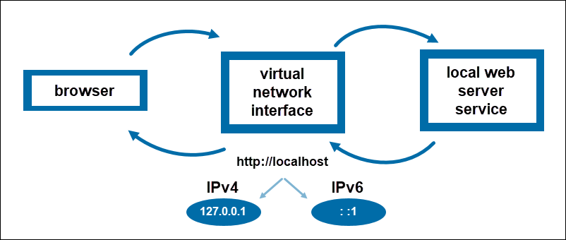
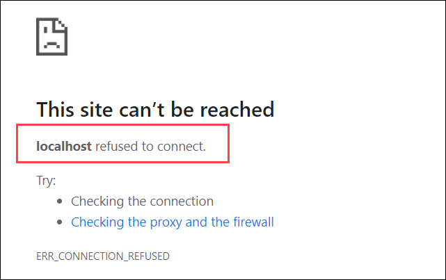

**What Is 127.0.0.1 Localhost?**

Introduction

Localhost (127.0.0.1) is a well-known term in computer networking. Still, if you are a beginner in web development or web hosting, learning about localhost is one of the first steps to mastering the craft.

**Learn what localhost is, how it is related to 127.0.01, and when to use it.**

## **What is Localhost (IP 127.0 0.1)?**

Localhost is the default name of the computer you are working on. The term is a pseudo name for 127.0.0.1, the IP address of the local computer. This IP address allows the machine to connect to and communicate with itself. Therefore, localhost (127.0.0.1) is used to establish an IP connection to the same device used by the end-user.

Although using **127.0.0.1** is the most common practice, the IPv4 network standard reserves the range **127.0.0.1 – 127.255.255.255** for localhost. Using another IP address within the range results in the same or similar manner. The IPv6 standard assigns one address to loopback - **:: 1**.

Localhost is also known as the loopback address.

**Note:** Every computer connected to the Internet or a local network has an IP address. Internet Protocol (IP) is a set of rules established to standardize identifying and sending information between computers and network devices. IP addresses are used as identifiers that allow communication between devices and ensure information is sent to the correct address.

## How Does a 127.0.0.1 Loopback Work?

When you open a browser and navigate to a web address you are essentially navigating to the alias of an IP address assigned to the server hosting the web page.

However, when typing **http://localhost** in a[web browser, the request is not forwarded to the Internet. Instead, it is managed entirely by the operating system, remains on the local network, and connects to the computer you are using. That is why localhost is also referred to as the **loopback address** - it loops you back to the machine you are logged into.

To [ping](https://phoenixnap.com/glossary/what-is-ping) the local machine in the command prompt, simply run **`localhost`** or **127.0.0.1** as a command in the terminal.

If there is no prior setup, you’re likely to get no response after pinging localhost or a message that the computer refused the request. This is because it is not expecting incoming connections. The response changes once you run a server on the computer as it starts listening to incoming requests.

**Note:** To learn more, check our tutorial localhost refused to connect.

## What is Localhost Used For?

The localhost server environment is mainly used for testing and development purposes. Read on to learn about some of its everyday use cases.

### Block Sites

Blocking specific websites on all browsers is straightforward with the localhost attribute. To do so, you need to edit the host file – a file containing the mappings of IP addresses to hostnames. The host file consists of two columns, where one is reserved for an IP address and the other for its corresponding hostname.

Add a new entry to the file and assign the localhost IP address 127.0.0.1 to the given hostname to block a website. Doing so prevents the system from looking for the site over the Internet. Instead, it searches for it on the local server with 127.0.0.1. Finally, as it cannot answer the request, the browser responds that it cannot connect to the wanted site.

### Test Web Apps and Programs

Localhost is often used for testing and development purposes. Its main advantage is allowing developers to simulate a connection without going online. As it is essential to test an application before exposing it to the Internet, utilizing localhost provides testing of all functions through a loopback.

Additionally, local server environments speed up development as the response time is much faster when pinging localhost than a remote machine over the Internet.

### Host Web Apps Locally

When developing a web app, it is common to host the application locally. Not only does localhost provide a safe environment for testing out new features, it can also be used for learning purposes. By running an application locally, developers can experiment with different technologies without consequences.

There are a number of platforms that offer all the components for web development on localhost, the starting point for most web developers. Popular solution stacks include LAMP , XAMPP, WAMP, MAMP, and others.

**Note:** LAMP and MEAN are software bundles used to develop web applications. Learn about LAMP vs. MEAN, see their pros and cons and their use cases in our comparison article.

Conclusion

After reading this article, you should better understand what localhost is and when to use it.

If you want to find out what is the difference between Localhost and 127.0.0.1, read our article Localhost vs. 127.0.0.1.

To broaden your networking knowledge, check out how DNS records are used to store information about domains such as IP addresses, aliases, and security certificates in our article DNS Record Types Explained.