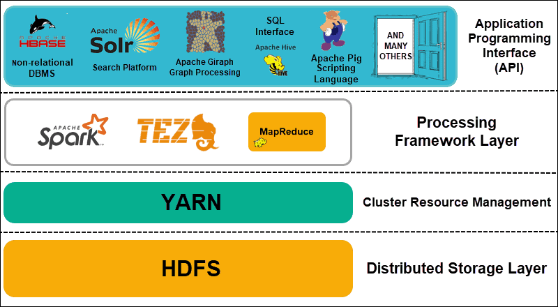
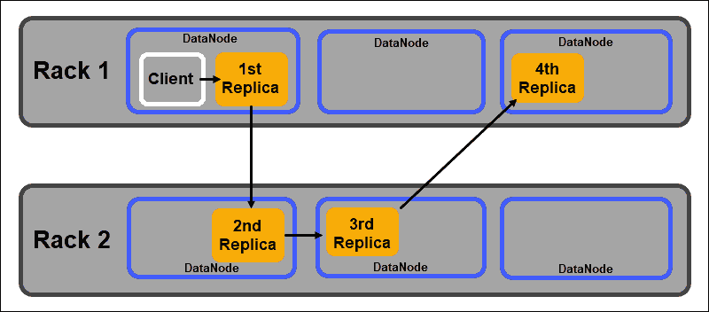
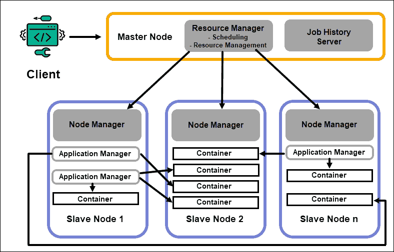
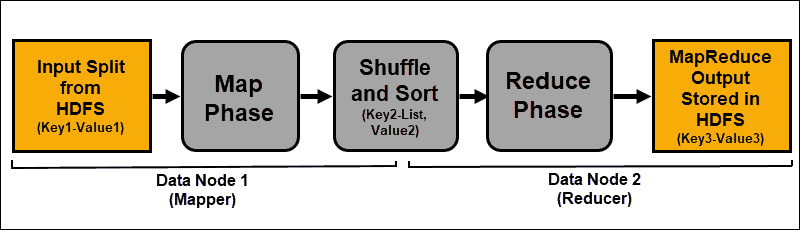
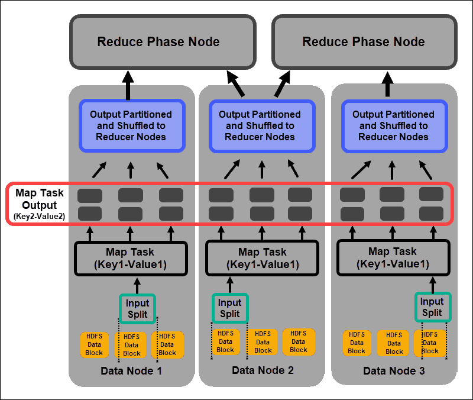
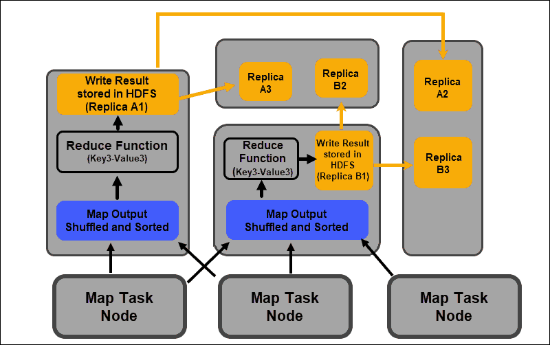

 

## Hadoop Architecture

### 1. Introduction

Apache Hadoop is an exceptionally successful framework that manages to solve the many challenges posed by big data. This efficient solution distributes storage and processing power across thousands of nodes within a cluster. A fully developed Hadoop platform includes a collection of tools that enhance the core Hadoop framework and enable it to overcome any obstacle.

The underlying architecture and the role of the many available tools in a [Hadoop ecosystem](HadoopEcosystem.md) can prove to be complicated for newcomers.

### 2. Overview of Hadoop Architecture

Big data, with its immense volume and varying [data structures](DataStructure.md) has overwhelmed traditional networking frameworks and tools. Using high-performance hardware and specialized servers can help, but they are inflexible and come with a considerable price tag.

Hadoop manages to process and store vast amounts of data by using interconnected affordable commodity hardware. Hundreds or even thousands of low-cost dedicated servers working together to store and process data within a single ecosystem.

[The Hadoop Distributed File System (HDFS)](HDFS.md), **YARN**, and **MapReduce** are at the heart of that ecosystem. HDFS is a set of protocols used to store large data sets, while MapReduce efficiently processes the incoming data.

A Hadoop cluster consists of one, or several, Master Nodes and many more so-called Slave Nodes. HDFS and MapReduce form a flexible foundation that can linearly scale out by adding additional nodes. However, the complexity of big data means that there is always room for improvement.

**Yet Another Resource Negotiator (YARN)** was created to improve resource management and scheduling processes in a Hadoop cluster. The introduction of YARN, with its generic interface, opened the door for other data processing tools to be incorporated into the Hadoop ecosystem.

A vibrant developer community has since created numerous open-source [Apache](Apache.md) projects to complement Hadoop. Many of these solutions have catchy and creative names such as Apache Hive, Impala, Pig, Sqoop, Spark, and Flume. These tools compile and process various data types. They also provide user-friendly interfaces, messaging services, and improve cluster processing speeds.

An expanded software stack, with HDFS, YARN, and MapReduce at its core, makes Hadoop the go-to solution for processing big data.

### 3. Understanding the Layers of Hadoop Architecture

Separating the elements of distributed systems into functional layers helps streamline data management and development. Developers can work on frameworks without negatively impacting other processes on the broader ecosystem.

Hadoop can be divided into four (4) distinctive layers.

#### 3.1 Distributed Storage Layer

Each node in a Hadoop cluster has its own disk space, memory, bandwidth, and processing. The incoming data is split into individual data blocks, which are then stored within the HDFS distributed storage layer. HDFS assumes that every disk drive and slave node within the cluster is unreliable. As a precaution, HDFS stores three copies of each data set throughout the cluster. The HDFS master node (**NameNode**) keeps the metadata for the individual data block and all its replicas.

#### 3.2 Cluster Resource Management

Hadoop needs to coordinate nodes perfectly so that countless applications and users effectively share their resources. Initially, MapReduce handled both resource management and data processing. YARN separates these two functions. As the de-facto resource management tool for Hadoop, YARN is now able to allocate resources to different frameworks written for Hadoop. These include projects such as Apache Pig, Hive, Giraph, Zookeeper, as well as MapReduce itself.

#### 3.3 Processing Framework Layer

The processing layer consists of frameworks that analyze and process datasets coming into the cluster. The [structured and unstructured datasets](Structured-vs-Unstructured-Data.md) are mapped, shuffled, sorted, merged, and reduced into smaller manageable data blocks. These operations are spread across multiple nodes as close as possible to the servers where the data is located. Computation frameworks such as Spark, Storm, Tez now enable real-time processing, interactive query processing and other programming options that help the MapReduce engine and utilize HDFS much more efficiently.

#### 3.4 Application Programming Interface

The introduction of YARN in Hadoop 2 has lead to the creation of new processing frameworks and APIs. Big data continues to expand and the variety of tools needs to follow that growth. Projects that focus on search platforms, [data streaming](Spark-Streaming.md), user-friendly interfaces, programming languages, messaging, failovers, and security are all an intricate part of a comprehensive Hadoop ecosystem.

### 4. HDFS Explained

The Hadoop Distributed File System (HDFS) is fault-tolerant by design. Data is stored in individual data blocks in three separate copies across multiple nodes and server racks. If a node or even an entire rack fails, the impact on the broader system is negligible.

**DataNodes** process and store data blocks, while **NameNodes** manage the many DataNodes, maintain data block metadata, and control client access.

#### 4.1 NameNode

Initially, data is broken into abstract data blocks. The file metadata for these blocks, which include the file name, file permissions, IDs, locations, and the number of replicas, are stored in a fsimage, on the NameNode local memory.

Should a NameNode fail, HDFS would not be able to locate any of the data sets distributed throughout the DataNodes. This makes the NameNode the single point of failure for the entire cluster. This vulnerability is resolved by implementing a Secondary NameNode or a Standby NameNode.

##### Secondary NameNode

The Secondary NameNode served as the primary backup solution in early Hadoop versions. The Secondary NameNode, every so often, downloads the current fsimage instance and edit logs from the NameNode and merges them. The edited fsimage can then be retrieved and restored in the primary NameNode.

The failover is not an automated process as an administrator would need to recover the data from the Secondary NameNode manually.

##### Standby NameNode

The **High Availability** feature was introduced in Hadoop 2.0 and subsequent versions to avoid any downtime in case of the NameNode failure. This feature allows you to maintain two NameNodes running on separate dedicated master nodes.

The Standby NameNode is an automated failover in case an Active NameNode becomes unavailable. The Standby NameNode additionally carries out the check-pointing process. Due to this property, the Secondary and Standby NameNode are not compatible. A Hadoop cluster can maintain either one or the other.

##### Zookeeper

Zookeeper is a lightweight tool that supports high availability and redundancy. A Standby NameNode maintains an active session with the Zookeeper daemon.

If an Active NameNode falters, the Zookeeper daemon detects the failure and carries out the failover process to a new NameNode. Use Zookeeper to automate failovers and minimize the impact a NameNode failure can have on the cluster.

### 4.2 DataNode

Each DataNode in a cluster uses a background process to store the individual blocks of data on slave servers.

By default, HDFS stores three copies of every data block on separate DataNodes. The NameNode uses a rack-aware placement policy. This means that the DataNodes that contain the data block replicas cannot all be located on the same server rack.

A DataNode communicates and accepts instructions from the NameNode roughly twenty times a minute. Also, it reports the status and health of the data blocks located on that node once an hour. Based on the provided information, the NameNode can request the DataNode to create additional replicas, remove them, or decrease the number of data blocks present on the node.

### 4.3 Rack Aware Placement Policy

One of the main objectives of a distributed storage system like HDFS is to maintain high availability and replication. Therefore, data blocks need to be distributed not only on different DataNodes but on nodes located on different server racks.

This ensures that the failure of an entire rack does not terminate all data replicas. The HDFS NameNode maintains a default rack-aware replica placement policy:

- The first data block replica is placed on the same node as the client.
- The second replica is automatically placed on a random DataNode on a different rack.
- The third replica is placed in a separate DataNode on the same rack as the second replica.
- Any additional replicas are stored on random DataNodes throughout the cluster.

This rack placement policy maintains only one replica per node and sets a limit of two replicas per server rack.

Rack failures are much less frequent than node failures. HDFS ensures high reliability by always storing at least one data block replica in a DataNode on a different rack.

### 5. YARN Explained

YARN (Yet Another Resource Negotiator) is the default cluster management resource for Hadoop 2 and Hadoop 3. In previous Hadoop versions, MapReduce used to conduct both data processing and resource allocation. Over time the necessity to split processing and resource management led to the development of YARN.

YARN’s resource allocation role places it between the storage layer, represented by HDFS, and the MapReduce processing engine. YARN also provides a generic interface that allows you to implement new processing engines for various data types.

#### 5.1 ResourceManager

The ResourceManager (RM) daemon controls all the processing resources in a Hadoop cluster. Its primary purpose is to designate resources to individual applications located on the slave nodes. It maintains a global overview of the ongoing and planned processes, handles resource requests, and schedules and assigns resources accordingly. The ResourceManager is vital to the Hadoop framework and should run on a dedicated master node.

The RM sole focus is on scheduling workloads. Unlike MapReduce, it has no interest in failovers or individual processing tasks. This separation of tasks in YARN is what makes Hadoop inherently scalable and turns it into a fully developed computing platform.

#### 5.2 NodeManager

Each slave node has a NodeManager processing service and a DataNode storage service. Together they form the backbone of a Hadoop distributed system.

The DataNode, as mentioned previously, is an element of HDFS and is controlled by the NameNode. The NodeManager, in a similar fashion, acts as a slave to the ResourceManager. The primary function of the NodeManager daemon is to track processing-resources data on its slave node and send regular reports to the ResourceManager.

**Note:** YARN daemons and containers are Java processes working in Java VMs.

#### 5.3 Containers

Processing resources in a Hadoop cluster are always deployed in containers. A container has memory, system files, and processing space.

A container deployment is generic and can run any requested custom resource on any system. If a requested amount of cluster resources is within the limits of what’s acceptable, the RM approves and schedules that container to be deployed.

The container processes on a slave node are initially provisioned, monitored, and tracked by the NodeManager on that specific slave node.

#### 5.4 Application Master

Every container on a slave node has its dedicated Application Master. Application Masters are deployed in a container as well. Even MapReduce has an Application Master that executes map and reduce tasks.

As long as it is active, an Application Master sends messages to the Resource Manager about its current status and the state of the application it monitors. Based on the provided information, the Resource Manager schedules additional resources or assigns them elsewhere in the cluster if they are no longer needed.

The Application Master oversees the full lifecycle of an application, all the way from requesting the needed containers from the RM to submitting container lease requests to the NodeManager.

#### 5.5 JobHistory Server

The JobHistory Server allows users to retrieve information about applications that have completed their activity. The REST API provides interoperability and can dynamically inform users on current and completed jobs served by the server in question.

#### 5.6 How Does YARN Work?

A basic workflow for deployment in YARN starts when a client application submits a request to the ResourceManager.

1. The **ResourceManager** instructs a **NodeManager** to start an **Application Master** for this request, which is then started in a container.
2. The newly created **Application Master** registers itself with the **RM**. The Application Master proceeds to contact the **HDFS NameNode** and determine the location of the needed data blocks and calculates the amount of map and reduce tasks needed to process the data.
3. The **Application Master** then requests the needed resources from the **RM** and continues to communicate the resource requirements throughout the life-cycle of the container.
4. The **RM** schedules the resources along with the requests from all the other **Application Masters** and queues their requests. As resources become available, the RM makes them available to the Application Master on a specific slave node.
5. The **Application Manager** contacts the **NodeManager** for that slave node and requests it to create a container by providing variables, authentication tokens, and the command string for the process. Based on that request, the **NodeManager** creates and starts the **container**.
6. The **Application Manager** then monitors the process and reacts in the event of failure by restarting the process on the next available slot. If it fails after four different attempts, the entire job fails. Throughout this process, the Application Manager responds to client status requests.

Once all tasks are completed, the Application Master sends the result to the client application, informs the RM that the application has completed its task, deregisters itself from the Resource Manager, and shuts itself down.

The RM can also instruct the NameNode to terminate a specific container during the process in case of a processing priority change.

### 6. MapReduce Explained

MapReduce is a programming algorithm that processes data dispersed across the Hadoop cluster. As with any process in Hadoop, once a MapReduce job starts, the ResourceManager requisitions an Application Master to manage and monitor the MapReduce job lifecycle.

The Application Master locates the required data blocks based on the information stored on the NameNode. The AM also informs the ResourceManager to start a MapReduce job on the same node the data blocks are located on. Whenever possible, data is processed locally on the slave nodes to reduce bandwidth usage and improve cluster efficiency.

The input data is mapped, shuffled, and then reduced to an aggregate result. The output of the MapReduce job is stored and replicated in HDFS.

he Hadoop servers that perform the mapping and reducing tasks are often referred to as **Mappers** and **Reducers**.

The ResourceManager decides how many mappers to use. This decision depends on the size of the processed data and the memory block available on each mapper server.

**Note:** Check out our in-depth guide on [what is MapReduce and how does it work](HadoopMapReduce.md).

#### 6.1 Map Phase

The mapping process ingests individual logical expressions of the data stored in the HDFS data blocks. These expressions can span several data blocks and are called **input splits***.* Input splits are introduced into the mapping process as *key-value pairs*.

A mapper task goes through every key-value pair and creates a new set of key-value pairs, distinct from the original input data. The complete assortment of all the key-value pairs represents the output of the mapper task.

Based on the key from each pair, the data is grouped, partitioned, and shuffled to the reducer nodes.

#### 6.2 Shuffle and Sort Phase

**Shuffle** is a process in which the results from all the map tasks are copied to the reducer nodes. The copying of the map task output is the only exchange of data between nodes during the entire MapReduce job.

**Note:** Output produced by map tasks is stored on the mapper node’s local disk and not in HDFS. This means that the data is not part of the Hadoop replication process and rack placement policy.

The output of a map task needs to be arranged to improve the efficiency of the reduce phase. The mapped key-value pairs, being shuffled from the mapper nodes, are arrayed by key with corresponding values. A reduce phase starts after the input is **sorted** by key in a single input file.

The shuffle and sort phases run in parallel. Even as the map outputs are retrieved from the mapper nodes, they are grouped and sorted on the reducer nodes.

#### 6.3 Reduce Phase

The map outputs are shuffled and sorted into a single reduce input file located on the reducer node. A reduce function uses the input file to aggregate the values based on the corresponding mapped keys. The output from the reduce process is a new key-value pair. This result represents the output of the entire MapReduce job and is, by default, stored in HDFS.

All reduce tasks take place simultaneously and work independently from one another. A reduce task is also optional.

There can be instances where the result of a map task is the desired result and there is no need to produce a single output value.

### 7. Best Practices for Deploying Hadoop

The following section explains how underlying hardware, user permissions, and maintaining a balanced and reliable cluster can help you get more out of your Hadoop ecosystem.

#### 7.1 Adjust Hadoop User Permissions

The Kerberos network protocol is the chief authorization system in Hadoop. It makes sure that only verified nodes and users have access and operate within the cluster.

Once you install and configure a Kerberos Key Distribution Center, you need to make several changes to the Hadoop configuration files. The Hadoop *core-site.xml* file defines parameters for the entire Hadoop cluster. Set the **`hadoop.security.authentication`** parameter within the *core-site.xml* to **`kerberos`***.* The same property needs to be set to **`true`** to enable service authorization.

Access control lists in the *hadoop-policy-xml* file can also be edited to grant different access levels to specific users. Striking a balance between necessary user privileges and giving too many privileges can be difficult with basic command-line tools.

It is a good idea to use additional security frameworks such as **Apache** **Ranger** or **Apache Sentry**. These tools help you manage all security-related tasks from a central, user-friendly environment. Use them to provide specific authorization for tasks and users while keeping complete control over the process.

#### 7.2 Balanced Hadoop Cluster

A distributed system like Hadoop is a dynamic environment. Adding new nodes or removing old ones can create a temporary imbalance within a cluster. Data blocks can become under-replicated.

Your goal is to spread data as consistently as possible across the slave nodes in a cluster. Use the Hadoop cluster-balancing utility to change predefined settings. Define your balancing policy with the **`hdfs balancer`** command. This command and its options allow you to modify node disk capacity thresholds.

The default block size starting from Hadoop 2.x is 128MB. Hadoop allows a user to change this setting. Consider changing the default data block size if processing sizable amounts of data; otherwise, the number of started jobs could overwhelm your cluster.

If you increase the data block size, the input to the map task is going to be larger, and there are going to be fewer map tasks started. This, in turn, means that the shuffle phase has much better throughput when transferring data to the reducer node. This simple adjustment can decrease the time it takes a MapReduce job to complete.

#### 7.3 Scaling Hadoop (Hardware)

The NameNode is a vital element of your Hadoop cluster. Engage as many processing cores as possible for this node. The amount of RAM defines how much data gets read from the node’s memory. If you overtax the resources available to your Master Node, you restrict the ability of your cluster to grow.

Redundant power supplies should always be reserved for the Master Node. Try not to employ redundant power supplies and valuable hardware resources for data nodes. They are an important part of a Hadoop ecosystem, however, they are expendable. Affordable dedicated servers, with intermediate processing capabilities, are ideal for data nodes as they consume less power and produce less heat.

Hadoop’s scaling capabilities are the main driving force behind its widespread implementation. It is necessary always to have enough space for your cluster to expand. Quickly adding new nodes or disk space requires additional power, networking, and cooling. All this can prove to be very difficult without meticulously [planning for likely future growth](future-proof-your-it-strategy.md).

#### 7.4 Scaling Hadoop (Software)

New Hadoop-projects are being developed regularly and existing ones are improved with more advanced features.

Even legacy tools are being upgraded to enable them to benefit from a Hadoop ecosystem. Always keep an eye out for new developments on this front. The variety and volume of incoming data sets mandate the introduction of additional frameworks.

Implementing a new user-friendly tool can solve a technical dilemma faster than trying to create a custom solution. Do not shy away from already developed commercial quick fixes. The market is saturated with vendors offering Hadoop-as-a-service or tailored standalone tools.

#### 7.5 Data Reliability and Fault Toleration

H*eartbeat* is a recurring TCP handshake signal. DataNodes, located on each slave server, continuously send a heartbeat to the NameNode located on the master server. The default heartbeat time-frame is three seconds. If the NameNode does not receive a signal for more than ten minutes, it writes the DataNode off, and its data blocks are auto-scheduled on different nodes.

Do not lower the heartbeat frequency to try and lighten the load on the NameNode. Keeping NameNodes ‘informed’ is crucial, even in extremely large clusters. Without a regular and frequent heartbeat influx, the NameNode is severely hampered and cannot control the cluster as effectively.

To avoid serious fault consequences, keep the default rack awareness settings and store replicas of data blocks across server racks. If you lose a server rack, the other replicas survive, and the impact on data processing is minimal.

