# Hadoop on Virtual Machine

## 1. Operating System

```
bigdata@bd-vm:~$ lsb_release -a

No LSB modules are available.
Distributor ID    :   Ubuntu
Description       :   Ubuntu Mantic Minotaur (development branch)
Release           :   23.10
Codename          :   mantic
```

## 2. Java

```
$ java -version

Openjdk version "17.0.8" 2023-07-18
OpenJDK Runtime Environment (build 17.0.8+7-Ubuntu-1)
OpenJDK 64-Bit Server VM (build 17.0.8+7-Ubuntu-1, mixed mode, sharing)
```

Change java version

```
$ sudo update-alternatives --config java

There are 2 choices for the alternative java (providing /usr/bin/java).

  Selection    Path                                            Priority   Status
------------------------------------------------------------
  0            /usr/lib/jvm/java-17-openjdk-amd64/bin/java      1711      auto mode
* 1            /usr/lib/jvm/java-17-openjdk-amd64/bin/java      1711      manual mode
  2            /usr/lib/jvm/java-8-openjdk-amd64/jre/bin/java   1081      manual mode

Press <enter> to keep the current choice[*], or type selection number: 
```

## 3. Hadoop

### 3.1 Hadoop Installation

Download the Binary Hadoop : https://hadoop.apache.org/releases.html

Extract the downloaded file using the following command:
*tar -xvzf hadoop-3.3.6.tar.gz*

Move hadopp-3.3.6 folder into ~/apache folder and rename to hadoop 

```
$ mv ~/Downloads/hadoop-3.3.6 ~/apache/hadoop
```

Edit ~/.bashrc file. Add the following parameters:

```
 export HADOOP_HOME=~/apache/hadoop
 export PATH=$PATH:$HADOOP_HOME/bin
```

Refresh the contents of the bashrc file

```
$ source ~/.bashrc
```

Run the following commands to test the Hadoop binaries and make sure the binaries works on our local
machine:

    $ cd $HADOOP_HOME
    $ mkdir input
    $ cp etc/hadoop/.xml input bin/hadoop jar share/hadoop/mapreduce/hadoop-mapreduceexamples-3.3.6.jar grep input output 'dfs[a-z.]+'
    $ cat output/

If everything runs as expected, you will see an output directory showing some output, which shows that the sample command worked.

### 3.2 Enable Passwordless SSH for Hadoop user

Check if you can ssh to the localhost without a passphrase by running a simple command, shown as follows:

```
$ ssh localhost
```

If you cannot ssh to localhost without a passphrase, execute the following commands:

```
$ ssh-keygen -t rsa -P '' -f ~/.ssh/id_rsa
$ cat ~/.ssh/id_rsa.pub >> ~/.ssh/authorized_keys
$ chmod 0600 ~/.ssh/authorized_key
```

### 3.3 Single Node Hadoop Deployment (Pseudo-Distributed Mode)

Hadoop excels when deployed in a **fully distributed mode** on a large cluster of networked servers*.* However, if you are new to Hadoop and want to explore basic commands or test applications, you can configure Hadoop on a single node.

This setup, also called **pseudo-distributed mode**, allows each Hadoop daemon to run as a single Java process. A Hadoop environment is configured by editing a set of configuration files:

- .bashrc
- hadoop-env.sh
- core-site.xml
- hdfs-site.xml
- mapred-site-xml
- yarn-site.xml

#### 3.3.1 Configure Hadoop Environment Variables (.bashrc)

```
sudo nano ~/.bashrc
```

Define the Hadoop environment variables by adding the following content to the end of the file: 

```
# Hadoop Related Options
export JAVA_HOME=/usr/lib/jvm/java-17-openjdk-amd64
export APACHE_HOME=~/apache
export HADOOP_HOME=~/apache/hadoop
export HADOOP_MAPRED_HOME=${HADOOP_HOME}
export HADOOP_COMMON_HOME=${HADOOP_HOME}
export HADOOP_HDFS_HOME=${HADOOP_HOME}
export YARN_HOME=${HADOOP_HOME}
export PATH=$PATH:$JAVA_HOME/bin:$HADOOP_HOME/bin:$HADOOP_HOME/sbin
```

It is vital to apply the changes to the current running environment by using the following command:

```
source ~/.bashrc
```

#### 3.3.2 Edit hadoop-env.sh File

The *hadoop-env.sh* file serves as a master file to configure YARN, [HDFS](HDFS.md), [MapReduce](HadoopMapReduce.md), and Hadoop-related project settings.

When setting up a **single node Hadoop cluster**, you need to define which Java implementation is to be utilized. Use the previously created **`$HADOOP_HOME`** variable to access the *hadoop-env.sh* file

If you need help to locate the correct Java path, run the following command in your terminal window:

```
$ which javac
/usr/bin/javac
$ readlink -f /usr/bin/javac
/usr/lib/jvm/java-8-openjdk-amd64/bin/javac
```

Set JAVA_HOME=/usr/lib/jvm/java-8-openjdk-amd64

```
sudo nano $HADOOP_HOME/etc/hadoop/hadoop-env.sh
```

Uncomment the **`$JAVA_HOME`** variable (i.e., remove the **`#`** sign) and add the full path to the OpenJDK installation on your system. If you have installed the same version as presented in the first part of this tutorial, add the following line:

```
export JAVA_HOME=/usr/lib/jvm/java-8-openjdk-amd64
```

#### 3.3.3 Edit core-site.xml File

The *core-site.xml* file defines HDFS and Hadoop core properties.

To set up Hadoop in a pseudo-distributed mode, you need to **specify the URL** for your NameNode, and the temporary directory Hadoop uses for the map and reduce process.

Open the *core-site.xml* file in a text editor:

```
sudo nano $HADOOP_HOME/etc/hadoop/core-site.xml
```

Edit or Add the following configuration to override the default values for the temporary directory and add your HDFS URL to replace the default local file system setting:

```
<configuration>
    <property>
        <name>fs.defaultFS</name>
        <value>hdfs://localhost:9000</value>
    </property>
</configuration>
```

#### 3.3.4 Edit hdfs-site.xml File

The properties in the *hdfs-site.xml* file govern the location for storing node metadata, fsimage file, and edit log file. Configure the file by defining the **NameNode** and **DataNode storage directories**.

Additionally, the default **`dfs.replication`** value of **`3`** needs to be changed to **`1`** to match the single node setup.

Use the following command to open the *hdfs-site.xml* file for editing:

```
sudo nano $HADOOP_HOME/etc/hadoop/hdfs-site.xml
```

Add the following configuration to the file and, if needed, adjust the NameNode and DataNode directories to your custom locations:

```
<configuration>

     <property>
          <name>dfs.replication</name>
          <value>1</value>
     </property>

     <property>
       <name>dfs.name.dir</name>
        <value>/home/bigdata/apache/dfs/name</value>
     </property>

     <property>
       <name>dfs.data.dir</name>
        <value>/home/bigdata/apache/dfs/data</value>
     </property>

     <property>
       <name>fs.checkpoint.dir</name>
        <value>/home/bigdata/apache/dfs/namesecondary</value>
     </property>

</configuration>
```

#### 3.3.5 Edit mapred-site.xml File

Use the following command to access the *mapred-site.xml* file and **define MapReduce values**:

```
sudo nano $HADOOP_HOME/etc/hadoop/mapred-site.xml
```

Add the following configuration to change the default MapReduce framework name value to **`yarn`**:

```
<configuration>
<property>
  <name>mapreduce.framework.name</name>
  <value>yarn</value>
</property>
</configuration>
```

#### 3.4.6 Edit yarn-site.xml File

The *yarn-site.xml* file is used to define settings relevant to **YARN**. It contains configurations for the **Node Manager, Resource Manager, Containers,** and **Application Master**.

Open the *yarn-site.xml* file in a text editor:

```
sudo nano $HADOOP_HOME/etc/hadoop/yarn-site.xml
```

Append the following configuration to the file:

```
<configuration>
<property>
  <name>yarn.nodemanager.aux-services</name>
  <value>mapreduce_shuffle</value>
</property>
<property>
  <name>yarn.nodemanager.aux-services.mapreduce.shuffle.class</name>
  <value>org.apache.hadoop.mapred.ShuffleHandler</value>
</property>
<property>
  <name>yarn.resourcemanager.hostname</name>
  <value>127.0.0.1</value>
</property>
<property>
  <name>yarn.acl.enable</name>
  <value>0</value>
</property>
<property>
  <name>yarn.nodemanager.env-whitelist</name>   
  <value>JAVA_HOME,HADOOP_COMMON_HOME,HADOOP_HDFS_HOME,YARN_HOME,HADOOP_MAPRED_HOME</value>
</property>
</configuration>
```

### 3.4 Create directories for :

- dfs.data.dir
  
  ```
  mkdir -p /home/bigdata/apache/dfs/data
  ```

- fs.checkpoint.dir
  
  ```
  mkdir -p /home/bigdata/apache/dfs/data
  ```

### 3.5 Format HDFS NameNode

It is important to **format the NameNode** before starting Hadoop services for the first time: 

```
$ hdfs namenode -format
```

### 3.6 Start Hadoop Cluster

Navigate to the *hadoop-3.2.1/sbin* directory and execute the following commands to start the NameNode and DataNode:

```
$ start-dfs.sh
```

The Hadoop daemon log output is written to the 

$HADOOP_LOG_DIR directory

(*defaults to $HADOOP_HOME/logs*).

- Check Hadoop Services

```
$ jps

bigdata@bd-vm:~/apache/hadoop$ jps |grep -vi jps
4256 NameNode
4597 SecondaryNameNode
4395 DataNode
```

- Make the HDFS directories required to execute MapReduce jobs:

```
$ hdfs dfs -mkdir /user
$ hdfs dfs -mkdir /user/bigdata
```

### 3.7 Access Hadoop UI from Browser

Open a browser to check your local Hadoop, which can be launched in the
browser as http://localhost:9870

```
http://localhost:9870
```

The following is what the HDFS installation looks like:

           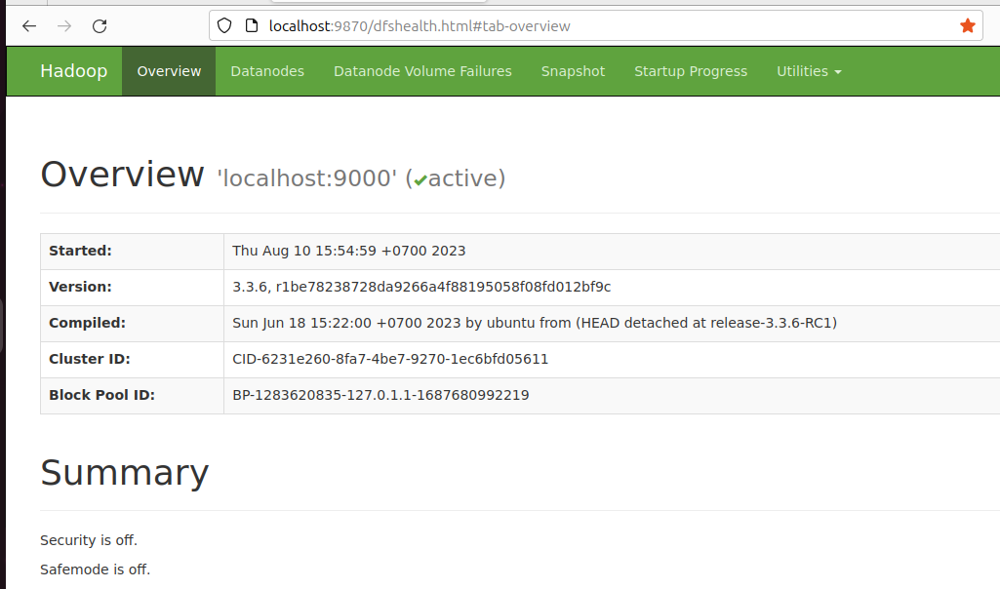

Clicking on the Datanodes tab shows the nodes as shown in the following
screenshot:

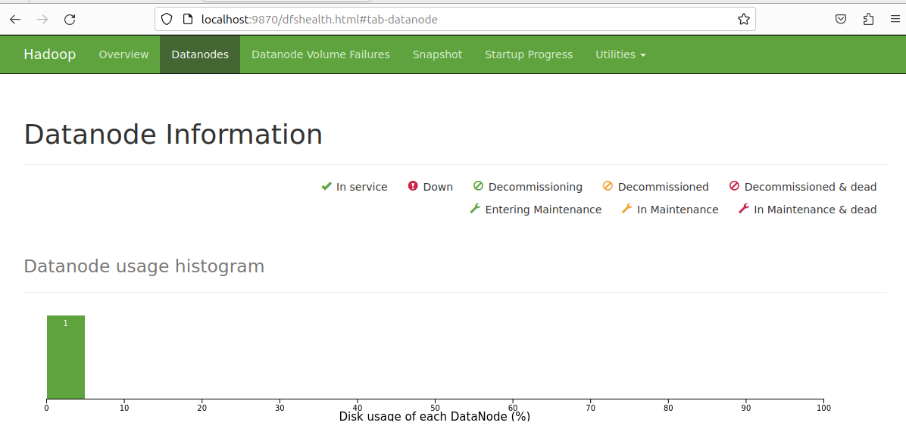

Click Startup Progress

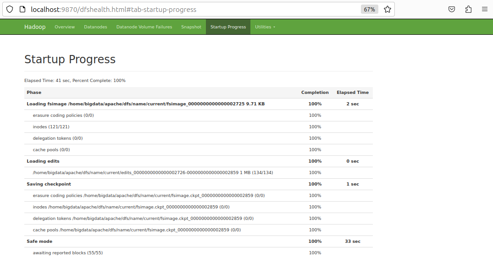

Clicking on the logs will show the various logs in your cluster, as shown in the
following screenshot: 

Utilities ==> Logs

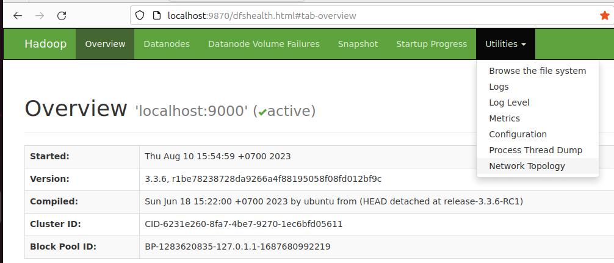

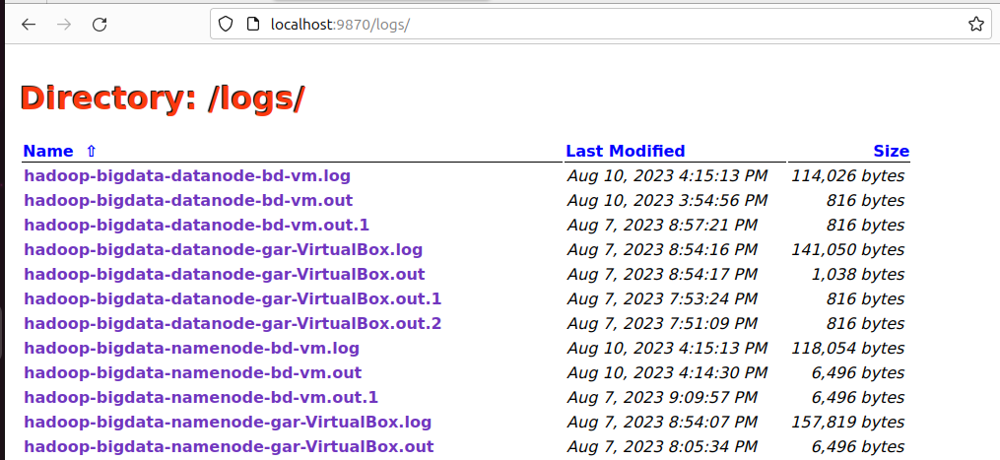

Utilities ==> Configuration

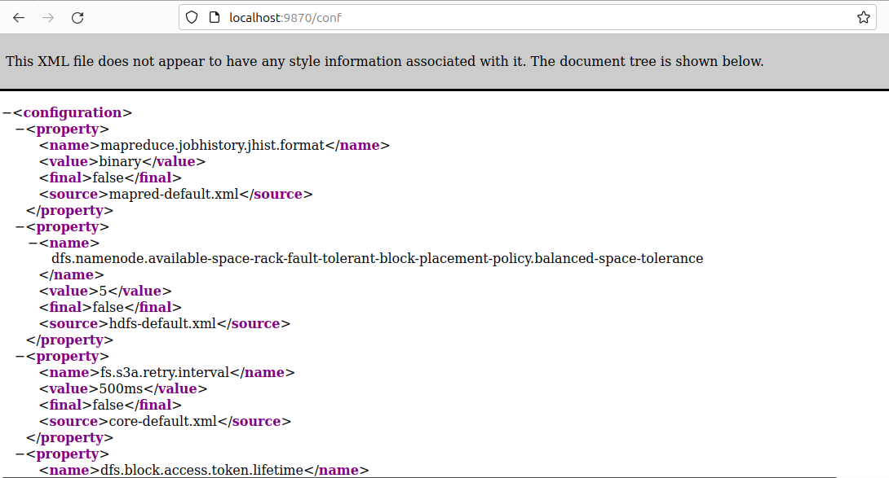

At this point, we should all be able to see and use a basic HDFS cluster. But this is just a
HDFS filesystem with some directories and files. We also need a job/task scheduling service to actually use the cluster for computational needs rather than just storage.

The default port **9864** is used to access individual DataNodes directly from your browser:

```
http://localhost:9864
```

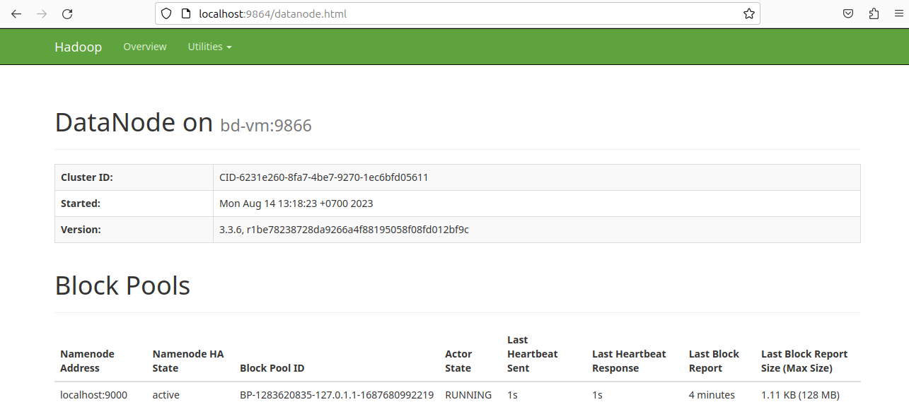

## 4. YARN

### 4.1 Starting YARN

In this section, we will set up a YARN service and start the components needed to run and operate a YARN cluster:

Start the ResourceManager daemon and the NodeManager daemon:

```
$ start-yarn.sh
```

Check YARN  service (ResourceManager)

```
$ jps | grep -vi jps

4256 NameNode
4597 SecondaryNameNode
4395 DataNode
6047 ResourceManager
```

### 4.2 Access YARN UI from Browser

The following is the YARN ResourceManager.

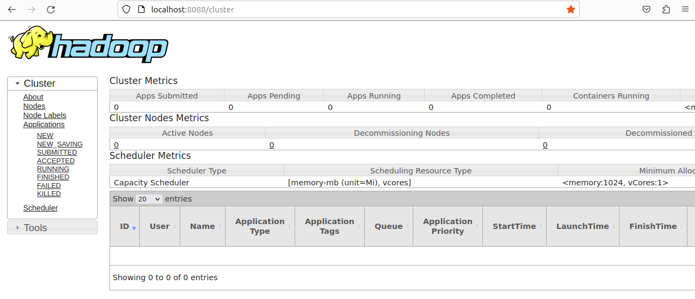

At this time, we should be able to see the running YARN service in our local cluster
running Hadoop 3.1.0. Next, we will look at some new features in Hadoop 3.x.

### 4.3 Erasure Coding

EC is a key change in Hadoop 3.x promising a significant improvement in HDFS utilization efficiencies as compared to earlier versions where replication factor of 3 for instance caused immense wastage of precious cluster file system for all kinds of data no matter what the relative importance was to the tasks at hand.
EC can be setup using policies and assigning the policies to directories in HDFS. For this, HDFS provides an ec subcommand to perform administrative commands related to EC:

```
$ hdfs ec -help
```

hdfs ec [generic options]
[-setPolicy -path <path> [-policy <policyName>] [-replicate]]
[-getPolicy -path <path>]
[-unsetPolicy -path <path>]

[-listPolicies]
[-addPolicies -policyFile <file>]
[-listCodecs]
[-enablePolicy -policy <policyName>]
[-disablePolicy -policy <policyName>]
[-help [cmd ...]]

By using -listPolicies, you can list all the EC policies currently setup in your cluster
along with the state of such policies whether they are ENABLED or DISABLED:

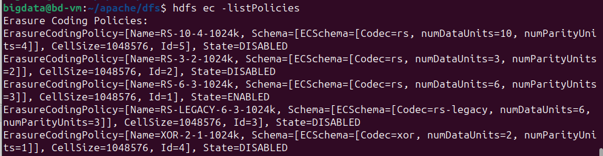

Lets test out EC in our cluster. First we will create directories in the HDFS shown as follows:

```
$ hdfs dfs -mkdir /user/normal
$ hdfs dfs -mkdir /user/ec
```

Once the two directories are created then you can set the policy on any path:

```
$ hdfs ec -setPolicy -path /user/ec -policy RS-6-3-1024k
```

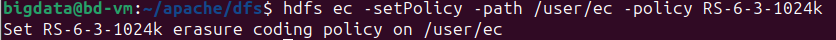

Now copying any content into the /user/ec folder falls into the newly set policy.
Type the command shown as follows to test this:

```
$ hdfs dfs -copyFromLocal ~/Documents/OnlineRetail.csv /user/ec
```

The following screenshot shows the result of the copying, as expected the system complains as we don't really have a cluster on our local system enough to implement EC. But this should give us an idea of what is needed and how it would look:

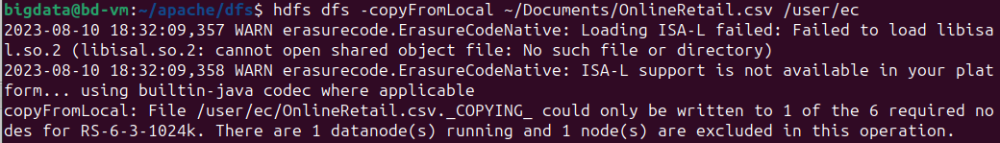

### 4.4 Intra-DataNode balancer

While HDFS always had a great feature of balancing the data between the data nodes in the cluster, often this resulted in skewed disks within data nodes. For instance, if you have four disks, two disks might take the bulk of the data and the other two might be under-utilized.
Given that physical disks (say 7,200 or 10,000 rpm) are slow to read/write, this kind of
skewing of data results in poor performance. Using an intra-node balancer, we can
rebalance the data amongst the disks.
Run the command shown in the following <u>example </u>to invoke disk balancing on a
DataNode to another cluster hostname :

```
hdfs diskbalancer -plan 10.0.2.17
```

## 5. HBase

Apache HBase™ is the Hadoop database. Use it when you need random, realtime read/write access to your Big Data

### 5.1 Installation

If you are intent on a simple deploy profile for the Apache HBase cluster where the data loading is light but the data needs to persist across node comings and goings, you could consider the Standalone HBase over HDFS deploy mode.

Download link to HBase 2.5.5 (example)

https://dlcdn.apache.org/hbase/2.5.5/hbase-2.5.5-bin.tar.gz

Download hbase-2.5.5-bin.tar.gz to your local machine. Then extract the HBase
binaries:

```
$ tar -xvzf hbase-2.5.5.-bin.tar.gz
```

This is a useful variation on the standalone HBase setup and has all HBase
daemons running inside one JVM but rather than persisting to the local filesystem, it
persists to an HDFS instance. Writing to HDFS where data is replicated ensures that data is persisted across node comings and goings. To configure this standalone variant, edit your hbase-site.xml setting the hbase.rootdir to point at a directory in your HDFS instance but then set hbase.cluster.distributed to false.

Move hbase-2.5.5. folder into ~/apache/, and rename to hbase.

```
$ mv ~/Downloads/hbase-2.5.5 ~/apache/hbase
```

The following is the **hbase**-**site.xml** with the hdfs port 9000 for the local cluster we
have installed mentioned as a property. If you leave this out there wont be a HBase
cluster installed.

```
<configuration>
  <!--
    The following properties are set for running HBase as a single process on a
    developer workstation. With this configuration, HBase is running in
    "stand-alone" mode and without a distributed file system. In this mode, and
    without further configuration, HBase and ZooKeeper data are stored on the
    local filesystem, in a path under the value configured for `hbase.tmp.dir`.
    This value is overridden from its default value of `/tmp` because many
    systems clean `/tmp` on a regular basis. Instead, it points to a path within
    this HBase installation directory.

    Running against the `LocalFileSystem`, as opposed to a distributed
    filesystem, runs the risk of data integrity issues and data loss. Normally
    HBase will refuse to run in such an environment. Setting
    `hbase.unsafe.stream.capability.enforce` to `false` overrides this behavior,
    permitting operation. This configuration is for the developer workstation
    only and __should not be used in production!__

    See also https://hbase.apache.org/book.html#standalone_dist
  -->
  <property> 
    <name>hbase.rootdir</name>
    <value>hdfs://localhost:9000/hbase</value>
  </property>
  <property>
    <name>hbase.cluster.distributed</name>
    <value>false</value>
  </property>
  <property>
    <name>hbase.wal.provider</name>
    <value>filesystem</value>
  </property>

</configuration>
```

### 5.2 Starting HBase

Make sure  the folowing parameters have been added in .bashrc file and  re-login (type source ~/bashrc) :

```
export HBASE_HOME=~/apache/hbase/
export PATH=$PATH:$HBASE_HOME/bin
```

We will do this by using start-hbase.sh script:

```
$ start-hbase.sh
```

### 5.3 Access HBase UI from Browser

http://localhost:16010

```
http://localhost:16010
```

The following screenshot shows the HBase cluster we just installed:

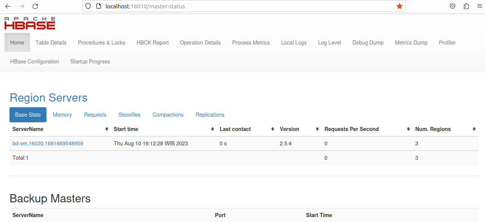

The following screenshot shows are more attributes of the HBase cluster setup showing versions, of various components:

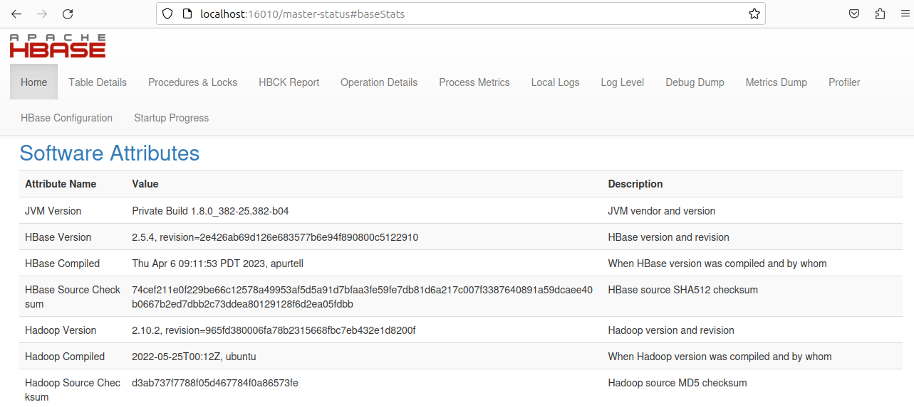

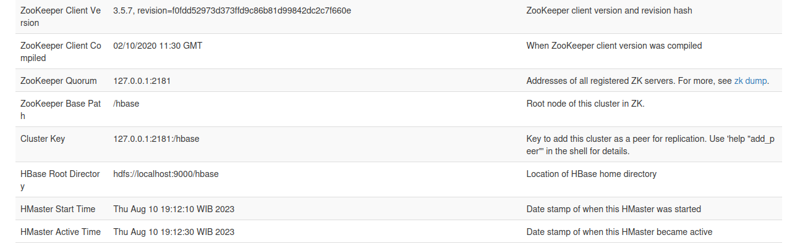

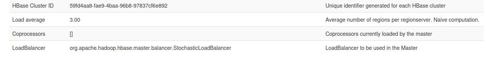

Startup Progress screenshot:

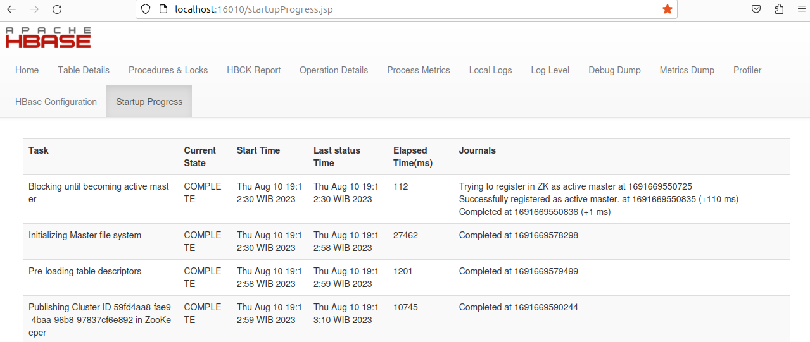

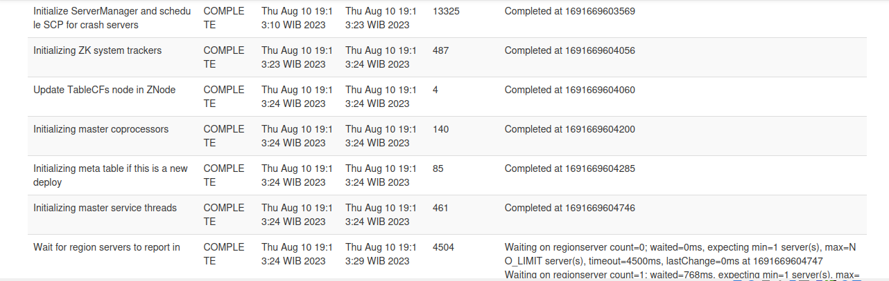


### 5.4 Using HBase

#### 5.4.1 Components Involved

- HDFS
- HBASE

#### 5.4.2 Sample Data

Import CSV data into HBase

In this post, we are having data in a CSV file. This file contains basic information about Employees. We want to import CSV data into HBase table.

Our sample data looks like below:

```
7369,SMITH,CLERK,7902,12/17/1980,800,20
7499,ALLEN,SALESMAN,7698,2/20/1981,1600,30
7521,WARD,SALESMAN,7698,2/22/1981,1250,30
7566,TURNER,MANAGER,7839,4/2/1981,2975,20
7654,MARTIN,SALESMAN,7698,9/28/1981,1250,30
7698,MILLER,MANAGER,7839,5/1/1981,2850,30
7782,CLARK,MANAGER,7839,6/9/1981,2450,10
7788,SCOTT,ANALYST,7566,12/9/1982,3000,20
7839,KING,PRESIDENT,NULL,11/17/1981,5000,10
7844,TURNER,SALESMAN,7698,9/8/1981,1500,30
7876,ADAMS,CLERK,7788,1/12/1983,1100,20
7900,JAMES,CLERK,7698,12/3/1981,950,30
7902,FORD,ANALYST,7566,12/3/1981,3000,20
7934,MILLER,CLERK,7782,1/23/1982,1300,10
```

You can download the sample data from this link [emp_data](https://bigdataprogrammers.com/wp-content/plugins/download-attachments/includes/download.php?id=2676 "emp_data").

#### 5.4.3 Solutions

We will go step-by-step in order to achieve our requirement with the given input.

##### Step 1: Input Data Preparation

Once we have the data in CSV format, we have to store it at a path from where it can get access by HBase that means we will keep input data in HDFS location. Currently, I am having a data file in local path, we will copy this to HDFS location using the command. In my case, I am copying file from local ‘*/home/bigdata/Downloads*‘ to HDFS ‘*/hbase/data*‘ path.

```
hdfs dfs -put ~/Downloads/emp_data.csv /hbase/data/
```

##### Step 2: Create HBase Table

In this step, we will create an HBase table to store the data. Let’s create this table based on the data we have in CSV file. Open HBase console using HBase shell and execute the query:

```
 create 'emp_data',{NAME => 'cf'}
```

Here, we have created an HBase table named emp_data with column family cf. All the columns of the CSV data will be store in cf family.

##### Step 3: Load data into HBase

We are done with data preparation and table creation. Now we have to load the data from HDFS to HBase. We will use below query:

```
hbase org.apache.hadoop.hbase.mapreduce.ImportTsv /
-Dimporttsv.separator=',' /
-Dimporttsv.columns='HBASE_ROW_KEY,cf:ename,cf:designation,cf:manager,cf:hire_date,cf:sal,cf:deptno' /
emp_data /hbase/data/emp_data.csv
```

Once we submit the job, a MapReduce job will get started. Let’s understand each argument in more details:

***-Dimporttsv.separator*** – Specify the delimiter of the source file

***-Dimporttsv.columns*** – Mentioned columns name. Here if you observe, we have not mentioned empno. The Rowkey will have empno value. The row key needs to be identified using the all-caps HBASE_ROW_KEY string; otherwise, it won’t start the job.

##### Step 4: Read data from HBase

Let’s check the data in HBase table.

bigdata@bd-vm:~$ *hbase shell*

```
hbase:004:0> scan 'emp_data'
ROW                           COLUMN+CELL                                                                         
 7369                         column=cf:deptno, timestamp=2023-08-11T11:27:15.068, value=20                       
 7369                         column=cf:designation, timestamp=2023-08-11T11:27:15.068, value=CLERK               
 7369                         column=cf:ename, timestamp=2023-08-11T11:27:15.068, value=SMITH                     
 7369                         column=cf:hire_date, timestamp=2023-08-11T11:27:15.068, value=12/17/1980            
 7369                         column=cf:manager, timestamp=2023-08-11T11:27:15.068, value=7902                    
 7369                         column=cf:sal, timestamp=2023-08-11T11:27:15.068, value=800                         
 7499                         column=cf:deptno, timestamp=2023-08-11T11:27:15.068, value=30                       
 7499                         column=cf:designation, timestamp=2023-08-11T11:27:15.068, value=SALESMAN            
 7499                         column=cf:ename, timestamp=2023-08-11T11:27:15.068, value=ALLEN                     
 7499                         column=cf:hire_date, timestamp=2023-08-11T11:27:15.068, value=2/20/1981             
 7499                         column=cf:manager, timestamp=2023-08-11T11:27:15.068, value=7698                    
 7499                         column=cf:sal, timestamp=2023-08-11T11:27:15.068, value=1600                        
 7521                         column=cf:deptno, timestamp=2023-08-11T11:27:15.068, value=30                       
 7521                         column=cf:designation, timestamp=2023-08-11T11:27:15.068, value=SALESMAN            
 7521                         column=cf:ename, timestamp=2023-08-11T11:27:15.068, value=WARD                      
 7521                         column=cf:hire_date, timestamp=2023-08-11T11:27:15.068, value=2/22/1981             
 7521                         column=cf:manager, timestamp=2023-08-11T11:27:15.068, value=7698                    
 7521                         column=cf:sal, timestamp=2023-08-11T11:27:15.068, value=1250                        
 7566                         column=cf:deptno, timestamp=2023-08-11T11:27:15.068, value=20                       
 7566                         column=cf:designation, timestamp=2023-08-11T11:27:15.068, value=MANAGER             
 7566                         column=cf:ename, timestamp=2023-08-11T11:27:15.068, value=TURNER                    
 7566                         column=cf:hire_date, timestamp=2023-08-11T11:27:15.068, value=4/2/1981              
 7566                         column=cf:manager, timestamp=2023-08-11T11:27:15.068, value=7839                    
 7566                         column=cf:sal, timestamp=2023-08-11T11:27:15.068, value=2975                        
 7654                         column=cf:deptno, timestamp=2023-08-11T11:27:15.068, value=30                       
 7654                         column=cf:designation, timestamp=2023-08-11T11:27:15.068, value=SALESMAN            
 7654                         column=cf:ename, timestamp=2023-08-11T11:27:15.068, value=MARTIN                    
 7654                         column=cf:hire_date, timestamp=2023-08-11T11:27:15.068, value=9/28/1981             
 7654                         column=cf:manager, timestamp=2023-08-11T11:27:15.068, value=7698                    
 7654                         column=cf:sal, timestamp=2023-08-11T11:27:15.068, value=1250                        
 7698                         column=cf:deptno, timestamp=2023-08-11T11:27:15.068, value=30                       
 7698                         column=cf:designation, timestamp=2023-08-11T11:27:15.068, value=MANAGER             
 7698                         column=cf:ename, timestamp=2023-08-11T11:27:15.068, value=MILLER                    
 7698                         column=cf:hire_date, timestamp=2023-08-11T11:27:15.068, value=5/1/1981              
 7698                         column=cf:manager, timestamp=2023-08-11T11:27:15.068, value=7839                    
 7698                         column=cf:sal, timestamp=2023-08-11T11:27:15.068, value=2850                        
 7782                         column=cf:deptno, timestamp=2023-08-11T11:27:15.068, value=10                       
 7782                         column=cf:designation, timestamp=2023-08-11T11:27:15.068, value=MANAGER             
 7782                         column=cf:ename, timestamp=2023-08-11T11:27:15.068, value=CLARK                     
 7782                         column=cf:hire_date, timestamp=2023-08-11T11:27:15.068, value=6/9/1981              
 7782                         column=cf:manager, timestamp=2023-08-11T11:27:15.068, value=7839                    
 7782                         column=cf:sal, timestamp=2023-08-11T11:27:15.068, value=2450                        
 7788                         column=cf:deptno, timestamp=2023-08-11T11:27:15.068, value=20                       
 7788                         column=cf:designation, timestamp=2023-08-11T11:27:15.068, value=ANALYST             
 7788                         column=cf:ename, timestamp=2023-08-11T11:27:15.068, value=SCOTT                     
 7788                         column=cf:hire_date, timestamp=2023-08-11T11:27:15.068, value=12/9/1982             
 7788                         column=cf:manager, timestamp=2023-08-11T11:27:15.068, value=7566                    
 7788                         column=cf:sal, timestamp=2023-08-11T11:27:15.068, value=3000                        
 7839                         column=cf:deptno, timestamp=2023-08-11T11:27:15.068, value=10                       
 7839                         column=cf:designation, timestamp=2023-08-11T11:27:15.068, value=PRESIDENT           
 7839                         column=cf:ename, timestamp=2023-08-11T11:27:15.068, value=KING                      
 7839                         column=cf:hire_date, timestamp=2023-08-11T11:27:15.068, value=11/17/1981            
 7839                         column=cf:manager, timestamp=2023-08-11T11:27:15.068, value=NULL                    
 7839                         column=cf:sal, timestamp=2023-08-11T11:27:15.068, value=5000                        
 7844                         column=cf:deptno, timestamp=2023-08-11T11:27:15.068, value=30                       
 7844                         column=cf:designation, timestamp=2023-08-11T11:27:15.068, value=SALESMAN            
 7844                         column=cf:ename, timestamp=2023-08-11T11:27:15.068, value=TURNER                    
 7844                         column=cf:hire_date, timestamp=2023-08-11T11:27:15.068, value=9/8/1981              
 7844                         column=cf:manager, timestamp=2023-08-11T11:27:15.068, value=7698                    
 7844                         column=cf:sal, timestamp=2023-08-11T11:27:15.068, value=1500                        
 7876                         column=cf:deptno, timestamp=2023-08-11T11:27:15.068, value=20                       
 7876                         column=cf:designation, timestamp=2023-08-11T11:27:15.068, value=CLERK               
 7876                         column=cf:ename, timestamp=2023-08-11T11:27:15.068, value=ADAMS                     
 7876                         column=cf:hire_date, timestamp=2023-08-11T11:27:15.068, value=1/12/1983             
 7876                         column=cf:manager, timestamp=2023-08-11T11:27:15.068, value=7788                    
 7876                         column=cf:sal, timestamp=2023-08-11T11:27:15.068, value=1100                        
 7900                         column=cf:deptno, timestamp=2023-08-11T11:27:15.068, value=30                       
 7900                         column=cf:designation, timestamp=2023-08-11T11:27:15.068, value=CLERK               
 7900                         column=cf:ename, timestamp=2023-08-11T11:27:15.068, value=JAMES                     
 7900                         column=cf:hire_date, timestamp=2023-08-11T11:27:15.068, value=12/3/1981             
 7900                         column=cf:manager, timestamp=2023-08-11T11:27:15.068, value=7698                    
 7900                         column=cf:sal, timestamp=2023-08-11T11:27:15.068, value=950                         
 7902                         column=cf:deptno, timestamp=2023-08-11T11:27:15.068, value=20                       
 7902                         column=cf:designation, timestamp=2023-08-11T11:27:15.068, value=ANALYST             
 7902                         column=cf:ename, timestamp=2023-08-11T11:27:15.068, value=FORD                      
 7902                         column=cf:hire_date, timestamp=2023-08-11T11:27:15.068, value=12/3/1981             
 7902                         column=cf:manager, timestamp=2023-08-11T11:27:15.068, value=7566                    
 7902                         column=cf:sal, timestamp=2023-08-11T11:27:15.068, value=3000                        
 7934                         column=cf:deptno, timestamp=2023-08-11T11:27:15.068, value=10                       
 7934                         column=cf:designation, timestamp=2023-08-11T11:27:15.068, value=CLERK               
 7934                         column=cf:ename, timestamp=2023-08-11T11:27:15.068, value=MILLER                    
 7934                         column=cf:hire_date, timestamp=2023-08-11T11:27:15.068, value=1/23/1982             
 7934                         column=cf:manager, timestamp=2023-08-11T11:27:15.068, value=7782                    
 7934                         column=cf:sal, timestamp=2023-08-11T11:27:15.068, value=1300                        
 empno                        column=cf:deptno, timestamp=2023-08-11T11:27:15.068, value=deptno                   
 empno                        column=cf:designation, timestamp=2023-08-11T11:27:15.068, value=designation         
 empno                        column=cf:ename, timestamp=2023-08-11T11:27:15.068, value=ename                     
 empno                        column=cf:hire_date, timestamp=2023-08-11T11:27:15.068, value=hire_date             
 empno                        column=cf:manager, timestamp=2023-08-11T11:27:15.068, value=manager                 
 empno                        column=cf:sal, timestamp=2023-08-11T11:27:15.068, value=sal                         
15 row(s)
Took 0.3245 seconds        
```

## 6. Hive

### 6.1 Architecture


#### 6.1.1 Hive Client

Hive allows writing applications in various languages, including Java, Python, and C++. It supports different types of clients such as:-

- Thrift Server - It is a cross-language service provider platform that serves the request from all those programming languages that supports Thrift.
- JDBC Driver - It is used to establish a connection between hive and Java applications. The JDBC Driver is present in the class org.apache.hadoop.hive.jdbc.HiveDriver.
- ODBC Driver - It allows the applications that support the ODBC protocol to connect to Hive.

#### 6.1.2 Hive Services

The following are the services provided by Hive:-

- Hive CLI - The Hive CLI (Command Line Interface) is a shell where we can execute Hive queries and commands.
- Hive Web User Interface - The Hive Web UI is just an alternative of Hive CLI. It provides a web-based GUI for executing Hive queries and commands.
- Hive MetaStore - It is a central repository that stores all the structure information of various tables and partitions in the warehouse. It also includes metadata of column and its type information, the serializers and deserializers which is used to read and write data and the corresponding HDFS files where the data is stored.
- Hive Server - It is referred to as Apache Thrift Server. It accepts the request from different clients and provides it to Hive Driver.
- Hive Driver - It receives queries from different sources like web UI, CLI, Thrift, and JDBC/ODBC driver. It transfers the queries to the compiler.
- Hive Compiler - The purpose of the compiler is to parse the query and perform semantic analysis on the different query blocks and expressions. It converts HiveQL statements into MapReduce jobs.
- Hive Execution Engine - Optimizer generates the logical plan in the form of DAG of map-reduce tasks and HDFS tasks. In the end, the execution engine executes the incoming tasks in the order of their dependencies.

### 6.2 Hive Installation

#### 6.2.1 Pre-requisite

- **Java Installation** - Check whether the Java is installed or not using the following command.
  
  ```
  $ java -version
  
  Openjdk version "17.0.8" 2023-07-18
  OpenJDK Runtime Environment (build 17.0.8+7-Ubuntu-1)
  OpenJDK 64-Bit Server VM (build 17.0.8+7-Ubuntu-1, mixed mode, sharing)
           
  ```

- **Hadoop Installation** - Check whether the Hadoop is installed or not using the following command.
  
  ```
  $ hadoop version
  
  Hadoop 3.3.6
  Source code repository https://github.com/apache/hadoop.git -r 1be78238728da9266a4f88195058f08fd012bf9c
  Compiled by ubuntu on 2023-06-18T08:22Z
  Compiled on platform linux-x86_64
  Compiled with protoc 3.7.1
  From source with checksum 5652179ad55f76cb287d9c633bb53bbd
  This command was run using /home/bigdata/apache/hadoop/share/hadoop/common/hadoop-common-3.3.6.jar
  ```

#### 6.2.2 Steps to install Apache Hive

- Download the Apache Hive tar file.
  
  https://dlcdn.apache.org/hive/
  
  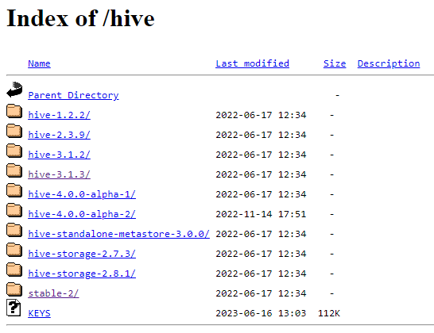

- Unzip the downloaded tar file.

        tar -xvf apache-hive-<version>-bin.tar.gz

- Move apache-hive<version> folder to ~/apache/

- Open and edit the .bashrc file. Add the following paths:
  
  ```
    export HIVE_HOME=~/apache/apache_hive  
    export PATH=$PATH:$HIVE_HOME/bin 
  ```

- Update the environment variable
  
  ```
  $ source ~/.bashrc
  ```

- Edit hive-site.xml
  
  ```
  <configuraion>
  
  <property>
  <name>system:java.io.tmpdir</name>
  <value>/tmp/hive</value>
  </property>
  
  <property>
  <name>hive.metastore.local</name>
  <value>TRUE</value>
  </property>
  
  <property>
  <name>hive.metastore.warehouse.dir</name>
  <value>/usr/hive/warehouse</value>
  </property>
  
  <property>
  <name>javax.jdo.option.ConnectionURL</name>
  <value>jdbc:derby:;databaseName=metastore_db;create=true</value>
  <description>
    JDBC connect string for a JDBC metastore.
    To use SSL to encrypt/authenticate the connection, provide database-specific SSL flag in the connection URL.
    For example, jdbc:postgresql://myhost/db?ssl=true for postgres database.
  </description>
  </property>
  
  </configuraion>
  ```

- Create the HDFS paths needed for hive (*hive.metastore.warehouse.dir* paramater in *hive-site.xml)*:
  
  ```
  hdfs dfs -mkdir -p /usr/hive/warehouse                                   
  ```

#### 6.2.3 Local / Embedded Metastore Database (Derby)

Hive works by leveraging the MapReduce framework and uses the tables and schemas to create the mappers and reducers for the MapReduce jobs that are run behind the scenes. In order to maintain the metadata about the data, Hive uses Derby which is an easy to use database. 

- Download Apache Derby
  
  In this section, we will look at installing Derby to be used in our Hive installation, https://db.apache.org/derby/derby_downloads.html
  
  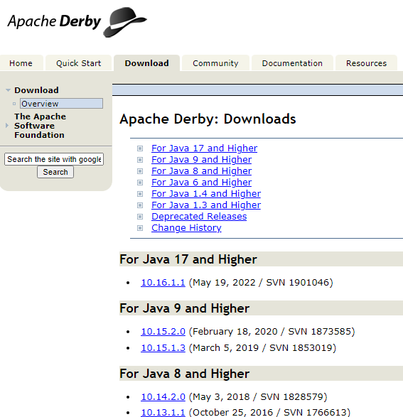
  
     

- Extract Derby using a command, as shown in the following code:
  tar -xvzf db-derby-<version>-bin.tar.gz
  
  ```
  tar -xvzf db-derby-10.16.1.1-bin.tar.gz
  ```

- Move db-derby-10.16.1.1 to ~/apache, and rename to dbderby.
  
  ```
  $ mv ~/Downloads/db-derby-10.16.1.1 ~/apache/dbderby
  ```

- Edit .bashrc file, and add the following parameters:
  
  ```
  export HIVE_HOME=/home/bigdata/apache/hive
  export DERBY_HOME=/home/bigdata/apache/dbderby
  export PATH=$PATH:$HIVE_HOME/bin:$DERBY_HOME/bin
  mkdir $DERBY_HOME/data
  cp $DERBY_HOME/lib/derbyclient.jar $HIVE_HOME/lib
  cp $DERBY_HOME/lib/derbytools.jar $HIVE_HOME/lib
  ```

- Now, start up the Derby server using a simple command, as shown in the
  following code:
  
  ```
  nohup startNetworkServer -h 0.0.0.0
  ```

- Once this is done, you have to create and initialize the derby instance:
  
  ```
  schematool -dbType derby -initSchema --verbose
  ```

- Now, you are ready to open the hive console:
  
  ```
  $ hive
  ```

### 6.3 Using Hive

As opposed to relational data warehouses, nested data models have complex types such as array, map, and struct. We can partition tables based on the values of one or more columns with the PARTITIONED BY clause. Moreover, tables or partitions can be bucketed using CLUSTERED BY columns, and data can be sorted within that bucket via SORT BY columns:

- Tables: They are very similar to RDBMS tables and contain rows and tables.

- Partitions: Hive tables can have more than one partition. They are mapped to
  subdirectories and filesystems as well.

- Buckets: Data can also be divided into buckets in Hive. They can be stored as
  files in partitions in the underlying filesystem.

The Hive query language provides the basic SQL-like operations. Here are few of the tasks that HQL can do easily:

- Create and manage tables and partitions

- Support various relational, arithmetic, and logical operators

- Evaluate functions

- Download the contents of a table to a local directory or the results of queries to
  the HDFS directory

##### 6.3.1 Creating Database

We first have to create a database to hold all the tables created in Hive. This step is easy and similar to most other databases:

```
create database mydb;
```

Check database

```
show databases;
```

Connect to database

```
use mydb;
```

##### 6.3.2 Creating Table

Once we have created a database, we are ready to create a table in the database. The table creation is syntactically similar to most RDBMS (database systems such as Oracle, MySQL).

First download OnlineRetail.csv file from URL: https://raw.githubusercontent.com/bigb0ss/Retail-atasets/master/Online%20Retail.csv

Put OnlineRetail.csv into HDFS /user/normal/

```
hdfs dfs -put /home/bigdata/Downloads/OnlineRetail.csv /user/normal/
```

Create external table

```
create external table OnlineRetail (
InvoiceNo string,
StockCode string,
Description string,
Quantity integer,
InvoiceDate string,
UnitPrice float,
CustomerID string,
Country string
) ROW FORMAT DELIMITED
FIELDS TERMINATED BY ','
LOCATION '/user/normal';
```

##### 6.3.3 Select some table rows

```
SELECT * from onlineretail LIMIT 5;
```

```
SELECT * FROM OnlineRetail WHERE Description='WHITE METAL LANTERN' limit 5;
```

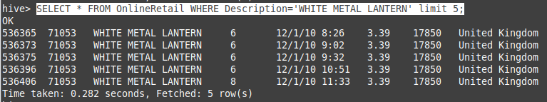

## 7. Apache Spark

### 7.1 Installation

Spark is Hadoop’s sub-project. Therefore, it is better to install Spark into a Linux based system. The following steps show how to install Apache Spark.

#### Step 1: Verifying Java Installation

Java installation is one of the mandatory things in installing Spark. Try the following command to verify the JAVA version.

$ java -version

openjdk version "17.0.7" 2023-04-18
OpenJDK Runtime Environment (build 17.0.7+7-Ubuntu-0ubuntu122.04.2)
OpenJDK 64-Bit Server VM (build 17.0.7+7-Ubuntu-0ubuntu122.04.2, mixed mode, sharing)

#### Step 2: Verifying Scala installation

You should Scala language to implement Spark. So let us verify Scala installation using following command.

```
$ scala -version

Scala code runner version 3.3.0 -- Copyright 2002-2023, LAMP/EPFL
```

In case you don’t have Scala installed on your system, then proceed to next step for Scala installation.

Download the latest version of Scala by visit the following link

https://www.scala-lang.org/download/

```
curl -fL https://github.com/coursier/coursier/releases/latest/download/cs-x86_64-pc-linux.gz | gzip -d > cs && chmod +x cs && ./cs setup
```

#### Step 3: Downloading Apache Spark

Download the latest version of Spark by visiting the following link [Download Spark](https://spark.apache.org/downloads.html). After downloading it, you will find the Spark tar file in the download folder.

#### Step 4: Installing Spark

Follow the steps given below for installing Spark.

- Extracting Spark tar
  
  ```
  $ tar xvf spark-3.4.1-bin-hadoop3.tgz
  ```

- Moving Spark software files
  
  ```
  $ mv ~/Downloads/~spark-3.4.1-bin-hadoop3 ~/apache/spark
  ```

- Edit ~/.bashrc file, ad  the following parameters:
  
  ```
  export SPARK_HOME=~/apache/spark
  export PATH=$PATH:$SPARK_HOME/bin
  ```

- Reload ~/.bashrc
  
  ```
  $ source ~/.bashrc
  ```
  
                

#### Step 5: Verifying the Spark Installation

Write the following command for opening Spark shell.

Scala Spark:

```
$ spark-shell

3/08/14 09:58:35 WARN Utils: Your hostname, bd-vm resolves to a loopback address: 127.0.1.1; using 10.0.2.15 instead (on interface enp0s3)
23/08/14 09:58:35 WARN Utils: Set SPARK_LOCAL_IP if you need to bind to another address
Setting default log level to "WARN".
To adjust logging level use sc.setLogLevel(newLevel). For SparkR, use setLogLevel(newLevel).
Spark context Web UI available at http://worker01:4040
Spark context available as 'sc' (master = local[*], app id = local-1691981932999).
Spark session available as 'spark'.
Welcome to
      ____              __
     / __/__  ___ _____/ /__
    _/ // _ // _ `/ __/  '_/
   /___/ .__//_,_/_/ /_//_/   version 3.4.1
      /_/

Using Scala version 2.12.17 (OpenJDK 64-Bit Server VM, Java 17.0.8)
Type in expressions to have them evaluated.
Type :help for more information.

scala> 
```

Python Spark:

```
$ pyspark


Python 3.11.4 (main, Jun  7 2023, 10:13:09) [GCC 12.3.0] on linux
Type "help", "copyright", "credits" or "license" for more information.
23/08/14 10:01:57 WARN Utils: Your hostname, bd-vm resolves to a loopback address: 127.0.1.1; using 10.0.2.15 instead (on interface enp0s3)
23/08/14 10:01:57 WARN Utils: Set SPARK_LOCAL_IP if you need to bind to another address
Setting default log level to "WARN".
To adjust logging level use sc.setLogLevel(newLevel). For SparkR, use setLogLevel(newLevel).
23/08/14 10:01:59 WARN HiveConf: HiveConf of name hive.metastore.local does not exist
Welcome to
      ____              __
     / __/__  ___ _____/ /__
    _/ // _ // _ `/ __/  '_/
   /__ / .__//_,_/_/ /_//_/   version 3.4.1
      /_/

Using Python version 3.11.4 (main, Jun  7 2023 10:13:09)
Spark context Web UI available at http://worker01:4040
Spark context available as 'sc' (master = local[*], app id = local-1691982120907).
SparkSession available as 'spark'.
>>> 
```

### 7.2 Starting Spark Services

#### 7.2.1 Start Standalone Spark Master Server

Now that you have completed configuring your environment for Spark, you can start a master server.

In the terminal, type:

```
start-master.sh
```

To view the Spark Web user interface, open a web browser and enter the [localhost IP address](127-0-0-1-localhost.md) on port 8080.

```
http://127.0.0.1:8080/
or
http://localhost:8080/
or 
http://<master server IP address>:8080
or
http://<devicename>:8080
```

The page shows your **Spark URL**, status information for workers, hardware resource utilization, etc.

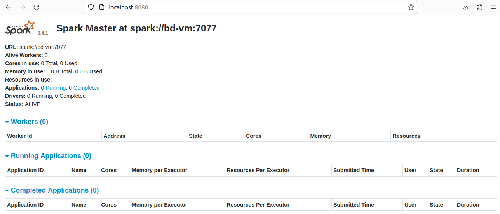

#### 7.2.2 Start Spark Slave Server (Start a Worker Process)

In this single-server, standalone setup, we will start one slave server along with the master server.

To do so, run the following command in this format:

```
start-worker.sh spark://master:port
```

The **`master`** in the command can be an IP or hostname.

In our case it is **`bd-vm`**:

```
start-worker.sh spark://bd-vm:7077
```

Now that a worker is up and running, if you reload Spark Master’s Web UI, you should see it on the list:

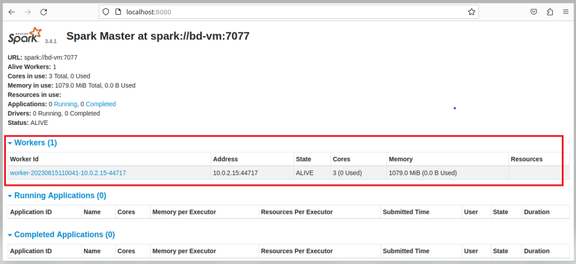

#### 7.2.3 Specify Resource Allocation for Workers

The default setting when starting a worker on a machine is to use all available CPU cores. You can specify the number of cores by passing the **`-c`** flag to the **`start-slave`** command.

For example, to start a worker and assign only **one CPU core** to it, enter this command:

```
start-worker.sh -c 1 spark://bd-vm:7077
```

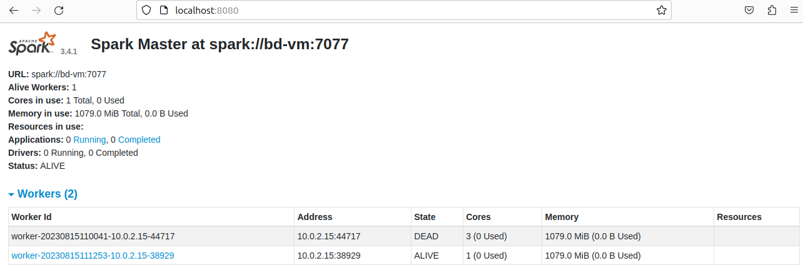

Similarly, you can assign a specific amount of memory when starting a worker. The default setting is to use whatever amount of RAM your machine has, minus 1GB.

To start a worker and assign it a specific amount of memory, add the **`-m`** option and a number. For gigabytes, use **`G`** and for megabytes, use **`M`**.

For example, to start a worker with 512MB of memory, enter this command:

```
start-worker.sh -m 512M spark://bd-vm:707
```


#### 7.2.4 Basic Commands to Start and Stop Master Server and Workers

Below are the basic commands for starting and stopping the Apache Spark master server and workers. Since this setup is only for one machine, the scripts you run default to the localhost.

**To start** **a master** **server** instance on the current machine, run the command we used earlier in the guide:

```
start-master.sh
```

**To stop the master** instance started by executing the script above, run:

```
stop-master.sh
```

**To stop a running worker** process, enter this command:

```
stop-worker.sh
```

You can **start both master and server** instances by using the start-all .spark.sh command:

<u>Note</u>: 

To distinguish between two files with the same name in $HADOOP_HOME/sbin, rename the files name in $SPARK_HOME/sbin :

```
mv $SPARK_HOME/sbin/start-all.sh $SPARK_HOME/sbin/start-all-spark.sh
mv $SPARK_HOME/sbin/stop-all.sh $SPARK_HOME/sbin/stop-all-spark.sh
```

```
start-all-spark.sh
```

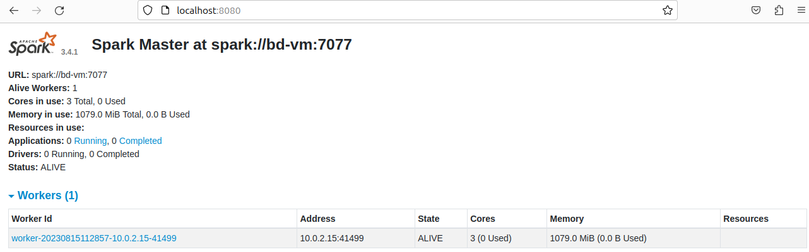

Similarly, you **can stop all instances** by using the following command:

```
stop-all-spark.sh
```

### 7.2 Using Spark (CLI)

#### 7.2.1 Scala (spark-shell)

```
$ cd $SPARK_HOME
$ pwd
/home/bigdata/apache/spark
$ ls
bin   data      jars        LICENSE   NOTICE  R          RELEASE  yarn
conf  examples  kubernetes  licenses  python  README.md  sbin 

Task:
How many lines contain "Spark" in README.md file ?


Solution with spark scala (spark-shell):

$ spark-shell
textFile: org.apache.spark.sql.Dataset[String] = [value: string]

scala> textFile.count() // Number of items in this Dataset
res0: Long = 125                                                                

scala> textFile.first() // First item in this Dataset
res1: String = # Apache Spark

scala> val linesWithSpark = textFile.filter(line => line.contains("Spark"))
linesWithSpark: org.apache.spark.sql.Dataset[String] = [value: string]

scala> textFile.filter(line => line.contains("Spark")).count() // How many lines contain "Spark"?
res2: Long = 20

scala> :q

==> Thera are 20 Spark word in README.md file.
```

#### 7.2.2 Spark (pyspark)

```
>>> textFile = spark.read.text("README.md")
>>> textFile.count()  # Number of rows in this DataFrame
125                                                                             
>>> textFile.first()  # First row in this DataFrame
Row(value='# Apache Spark')
>>> linesWithSpark = textFile.filter(textFile.value.contains("Spark"))
>>> textFile.filter(textFile.value.contains("Spark")).count()  # How many lines contain "Spark"?
20
>>> quit()

==> Thera are 20 Spark word in README.md file.
```
