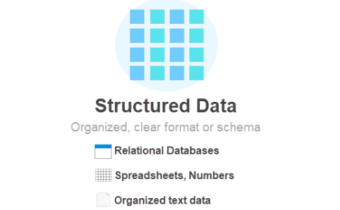

# **Structured vs. Unstructured Data: Understanding Differences**

## Introduction

Data is versatile, comes in various forms, and can be organized in numerous ways. One common categorization is [structured](https://phoenixnap.com/glossary/structured-data) or [unstructured data](https://phoenixnap.com/glossary/unstructured-data) with distinct approaches to [storage](https://phoenixnap.com/kb/what-is-data-storage), processing, and analysis. Understanding these differences aids in extracting valuable insights from any data set.

**This article outlines the crucial differences between structured vs. unstructured data.**

## Structured Data vs. Unstructured Data: Key Differences

Structured and unstructured data differ in many aspects. Both use different tools and approaches to process and analyze information.

Below is a brief comparison table of structured data vs. unstructured data.

| Structured Data                                                                                            | Unstructured Data                                                                                                       |
| ---------------------------------------------------------------------------------------------------------- | ----------------------------------------------------------------------------------------------------------------------- |
| Organized in a specific way with a fixed format.                                                           | Unorganized and with no fixed format.                                                                                   |
| Stored in a [relational database](https://phoenixnap.com/kb/what-is-a-relational-database) or spreadsheet. | Varied data formats which are not suitable for a relational database or spreadsheet.                                    |
| Easy to query and analyze.                                                                                 | Hard to search and analyze.                                                                                             |
| Data types limited to numbers, text, and dates.                                                            | Different data formats, such as audio, video, images, and unorganized text.                                             |
| Uses simpler methods to process data.                                                                      | Advanced data processing methods, such as [machine learning](https://phoenixnap.com/glossary/what-is-machine-learning). |
| Uses traditional database tools.                                                                           | Requires specialized tools.                                                                                             |
| Stored in [data warehouses](https://phoenixnap.com/kb/data-warehouse-architecture-explained).              | Stored in data lakes and utilizes [object storage](https://phoenixnap.com/object-storage).                              |
| The focus is on data quantity.                                                                             | The focus is on data quality.                                                                                           |

## What Is Structured Data?

Structured data is any type of data organized in a specific way. The data has a fixed format, such as tables with rows and columns.

Structured data resides in various formats that support a table-like structure. The data is simple to search through, sort, and analyze with [database tools](https://phoenixnap.com/kb/best-database-software) or in spreadsheets.

### Structured Data Formats

Some common examples of structured data include:

- **Relational databases** are the most common way to store structured data. Columns represent different fields, while each row is a data record.
- **Spreadsheets** store data in a table format. Columns represent individual variables, whereas rows hold specific values.
- **CSV (Comma Separated Values) files** use plain-text format to store data in fields and rows.
- **XML (Extensible Markup Language) files** are used for storing and transporting data, while tags and attributes define data elements.
- **JSON (JavaScript Object Notation) files** are a lightweight storage and data exchange format that uses a key-value pair structure.

**Note:** JSON and XML are a form of **semi-structured data**. The two formats do not have a table-like structure but include tags, markers, and hierarchies to separate elements.

### Structured Data Examples

Structured data is easy to model into a table format. Examples of structured data include:

- **People information**. A database with any information about people uses structured data. For example, first and last name, ID number, date of birth, email address, and phone number.
- **Products data**. A product list is easy to translate into structured data. Fields include a product name, number in stock, price, and an image link.
- **Geographic information**. A list of places is simple to represent with structured data. Different data types include city names, country names, population, latitude, and longitude.
- **Financial data**. Any form of financial data has a structured form. Examples include credit card information or stock market prices.

### Advantages and Disadvantages of Structured Data

Structured data focuses on organizing data in a usable and understandable format. The strict structure comes with some disadvantages too.

Below is a list of all the advantages and disadvantages of working with structured data.

**Advantages**

- **Consistent data quality**. The uniform approach to organizing data ensures consistency. As a result, the information is accurate and with minimal errors.
- **Simple to analyze**. The structured approach makes the data easy to query and analyze. The quicker analysis provides valuable insights and aids in decision-making processes.
- **Easy to integrate**. The straightforward design makes structured data simple to implement in different systems. Merging information enables data sharing across systems and departments.
- **Consistent structure**. A consistent approach to storing data makes the system familiar to use. A known format simplifies communication between different teams.

**Disadvantages**

- **Rigid system**. Structured data is not flexible. Modifying the structure and applying changes to the system is complex.
- **Limited context**. Organizing data in a structured format limits the data type scope. Variability in data provides a wider overview and better insights.
- **Hard to design**. As complexity grows, structured data becomes harder to organize. Structured data is sensitive to modifications and changes. Modeling a system requires specialized design approaches and experts.
- **Expensive**. Structured data requires investments. Data storage, [storage management](https://phoenixnap.com/glossary/storage-management), and maintenance experts are all costly.

### Structured Data Tools

Structured data tools help create, manipulate, and manage structured data. Several tools specialize in structured data. Below are a few examples:

- **Microsoft Excel, Google Sheets, and LibreOffice Calc**. They use similar approaches when working with structured data. The tools use spreadsheets to create, manipulate, and export data into various formats.
- **SQL (Structured Query Language)**. A [programming language](https://phoenixnap.com/glossary/what-is-a-programming-language) for [MySQL](https://phoenixnap.com/kb/mysql-workbench-ubuntu) and similar [RDBMS](https://phoenixnap.com/glossary/relational-database-management-system-rdbms). The language queries and manages structured data in relational databases.
- [Apache Hadoop](https://phoenixnap.com/blog/what-is-hadoop). A [big data](https://phoenixnap.com/glossary/big-data) framework for structured, semi-structured, and unstructured data.
- **Apache Spark**. Enables large-scale processing, [data streaming](https://phoenixnap.com/kb/spark-streaming), and structured data analysis with [dataframes](https://phoenixnap.com/kb/spark-dataframe).

**Note:** See our detailed comparison between [Hadoop vs. Spark](https://phoenixnap.com/kb/hadoop-vs-spark).

- **Tableau** is an interactive platform for creating dashboards and translating structured data into visuals.
- ****Python libraries****, such as https://phoenixnap.com/kb/introduction-to-python-pandas, [NumPy](https://phoenixnap.com/kb/install-numpy), and [SciPy](https://phoenixnap.com/kb/scipy-tutorial), allow the manipulation of structured data.
- **R libraries** for statistical programming and graphics work with structured data.

## What Is Unstructured Data?

Unstructured data is data that does not follow a fixed structure format. The data model is schema-less and cannot use traditional data processing methods.

The data includes all data formats in structured data (text, dates, numbers), and extra complex unstructured data, such as video, audio, and documents.

### Unstructured Data Formats

Some examples of unstructured data are:

- **Documents**, such as Word documents, PDFs, and other text-based information.
- **Images** in formats such as JPEG and PNG.
- **Audio** data in various formats, such as WAV or MP3.
- **Video** files in MP4, AVI, and other formats.
- **Sensor data** with streams from sensors in IoT devices. For example, data from smartwatches and various other devices and sensor systems.
- **Social media posts** from platforms such as Facebook, Twitter, and Instagram.
- **Emails** with many fields and various data types and attachments.

### Unstructured Data Examples

Unstructured data exists in a variety of applications and environments. Some examples of unstructured data include:

- **Communication records**. Chat records, messaging, chatbot, and meeting platform data. This includes text, images, videos, audio, and documents. Communication data is useful from a sales and marketing perspective.
- **Medical data**. Healthcare records contain both machine-generated and human-input data. Records from medical devices include images and sensor data. Information from medical personnel has a document form. Both contain useful data from a medical perspective.
- **Security systems**. Surveillance records contain a mix of unstructured video and audio data. Some other examples include CCTV footage or 911 call records.
- **Social media data**. Social media posts have an unstructured form. The mixed format data (text, multimedia, and user information) contains valuable insights. The data comes from platform-specific [APIs](https://phoenixnap.com/glossary/api-definition).

### Advantages and Disadvantages of Unstructured Data

Unstructured data provides informational richness due to the diversity of data types. The data is difficult to manage and process due to its complexity.

Below is a list of all the advantages and disadvantages of unstructured data.

**Advantages**

- **Diverse formats**. Unstructured data contains information with valuable contextual insights. Such diversity is not available with structured data.
- **Large volumes**. Most information has an unstructured format. Large data volumes provide a comprehensive overview of a topic to an analyst.
- **Real-time availability**. Unstructured data is often generated in [real-time](https://phoenixnap.com/glossary/real-time-data). Current information provides faster insight into issues and high-quality data.
- **Flexible**. The data does not conform to a schema or format, which makes it adaptable to changes.

**Disadvantages**

- **Inconsistent**. Unstructured data varies in quality and format. Combining data from many sources becomes difficult since there is no consistent standard.
- **Hard to process**. The data requires specialized skills to use and interpret. The dedicated tools and expertise are difficult to set up.
- **No structure**. The data is hard to integrate into existing workflows. A lack of structure makes information hard to combine with different data sources.
- **Security**. Unstructured data often contains confidential information. Working with such data requires extra caution to avoid [data breaches](https://phoenixnap.com/blog/what-is-a-data-breach).

### Unstructured Data Tools

Various tools are available for processing and analyzing unstructured data. The tools help extract information from various data formats. The simplest way to highlight tools that work with unstructured data is by the type of data they work with. Some helpful tools include:

- **Natural Language Processing (NLP)**. Uses [AI](https://phoenixnap.com/glossary/artificial-intelligence-definition) and machine learning to extract information from data written in human language. Processing language extracts meaning from any textual data. Natural language formats include chats, social media posts, and customer reviews. Example tools include NLTK and GPT-3.
- **Digital image processing**. Computer vision tools process visual data (both image and video). Tasks include object recognition, face detection, and image segmentation. Some tools that perform such tasks are [OpenCV](https://phoenixnap.com/kb/installing-opencv-on-ubuntu), TensorFlow, and [Keras](https://phoenixnap.com/kb/how-to-install-keras-on-linux).
- **Audio analysis**. Audio tools use signal processing and filtering to analyze audio data, such as speech or music. Automated transcription and speech recognition are some examples of audio analysis tasks. Some tools include IBM Watson text-to-speech and Google Cloud Speech-to-Text.
- **Querying and indexing**. Indexing tools allow organizing and searching through unstructured data. The tools help provide a semi-structured interface to query data. Examples include [Elasticsearch](https://phoenixnap.com/kb/elk-stack), Apache Solr, and Apache Lucene.
- **Visualization**. Data visualization tools help create dashboards and discover patterns in data. Some example software includes Kibana, Tableau, and PowerBI.

## Conclusion

After reading this guide, you know the differences between structured and unstructured data. Many tools are available for both, so learn how to utilize all data regardless of structure.
