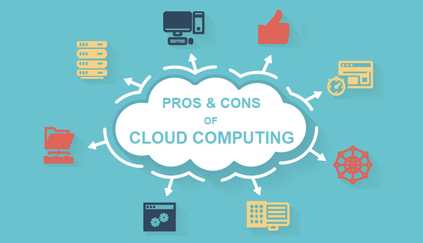
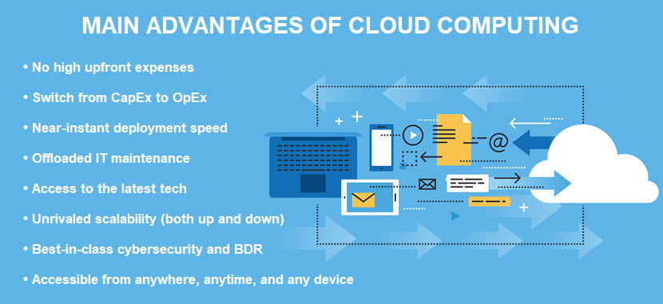
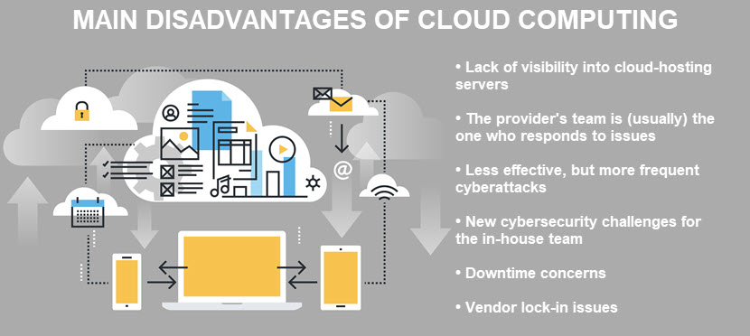

# Advantages and Disadvantages of Cloud Computing

Cloud computing has completely transformed the way businesses approach IT. Organizations of all sizes use the cloud to scale without restrictions, reduce IT costs, and free up in-house teams so they can focus on revenue-driving tasks.

But is using the cloud a no-brainer for all companies? Or are there some reasonable concerns to consider before starting your cloud journey?

This article **weighs the advantages and disadvantages of cloud computing**. Read on to learn about the pros and cons of using cloud services and see whether moving away from on-site hardware makes sense for your organization.

New to the cloud? If yes, we suggest you first read about the basics of [loud computing and learn how using the cloud compares to on-prem IT.

## Advantages of Cloud Computing

Below is an in-depth look at the main benefits of cloud computing.

### 1. Lower IT Costs

While setting up a top-tier cloud infrastructure is not cheap, that price tag is significantly smaller than what a comparable on-prem system would set you back. Cloud computing reduces IT expenses by eliminating the cost of:

- Brand-new hosting and networking equipment.
- Renting space for an in-house data center.
- Skilled IT technicians that keep on-prem hardware running.
- Electricity and air conditioning bills.
- Software licensing fees.
- Backup and redundancy equipment for ensuring high availability.

The pay-as-you-go payment model of using the cloud also means **you are never paying for IT resources you are not using**. These natural economies of scale eliminate unnecessary overhead and lead to more precise business planning.

The low cost of deploying to the cloud levels the playing field for businesses of all sizes. Small teams without the budget to purchase on-site dedicated servers can set up an enterprise-grade cloud infrastructure for a reasonable monthly subscription cost.

The main reason cloud computing lowers IT costs is that you switch from capital expenditures (CapEx) to operational expenses (OpEx). Learn why that shift should excite you in our CapEx vs OpEx article.

### 2. Near-Instant Deployment Speed

Cloud computing enables a user to spin new specs in a matter of seconds and a few clicks. As a result, a cloud-enabled team can develop and test new ideas without any infrastructural or process limitations.

If a team relies on on-site hardware, the process for deploying more storage room for a developer to test a product add-on would require the business to:

- Approve the upfront cost of new hardware.
- Procure a new server and wait for delivery.
- Take the current server offline.
- Set up new equipment.
- Fine-tune the server and restart the system.

You can use the cloud to boil this process down to a few minutes. The developer accesses the cloud, spins up a new virtual machine, and can start testing a new feature immediately. Once the testing ends, the developer shuts down the VM in a few clicks.

This deployment speed is enough to give you an edge over any competitor that does not use the cloud.

When it comes to fast deployments, there is no beating the agility of pNAP's Bare Metal Cloud BMC enables your team to get a new bare-metal server up and running in under 60 seconds!

### 3. Data Accessibility

Cloud computing allows users to access corporate data and apps from any device, anywhere, and anytime. All your employees need is access to the Internet, making working on the move easier than ever before.

The ability to securely access and share files paves the way for better team collaboration. Multiple people can edit a document or work on the same files simultaneously, so you:

- Provide management with a clear record of any revisions or updates.
- Can reliably maintain consistency in data.
- Lower the impact of human error.
- Eliminate the likelihood of teams working in silos and saving different versions of a file.
- Ensure all workers (developers, remote employees, traveling sales staff, freelances) stay in the loop.

This level of data accessibility makes the cloud a natural fit with the post-pandemic workforce that is more and more turning to remote-first work.

Remote-first strategies offer a line of benefits, but spread-out teams introduce risks we did not have to worry about before. Read about best practices for securing remote access for employees and ensure the new way of working does not lead to exploitable weaknesses. 

### 4. Unrivaled Scalability (Both Up and Down)

Whenever a cloud-based app requires extra bandwidth, computing power, or storage space, you can scale up computing resources to meet the current demand. The same principle works in reverse—if an app's needs exceed existing resources, you can scale down until the demand rises again.

The same strategy is not as simple for on-prem hardware. Scaling up requires a lengthy (and costly) process of purchasing and setting up new equipment. Scaling down requires you to turn off and set aside devices you already bought.

When weighing the advantages and disadvantages of cloud computing, scalability is often a key factor. The ability to seamlessly add or subtract resources has a two-fold positive effect:

- You can never end up in a situation where you do not have enough IT resources to meet current demand.
- Since you can always scale down, you ensure you never pay for resources you are not actively using.

If your needs vary massively throughout the year (e.g., if you have spikes in traffic during the holiday season), the cloud makes for a hand-in-glove fit. When the demand is high, you deploy additional cloud storage and processing; once traffic goes down, you scale down and minimize costs until the next surge in traffic.

Also worth pointing out is that **scaling up or down in a cloud does not cause downtime**. Whereas you must shut down a physical server when adding or removing resources, tweaking a cloud environment does not take your services offline.

Cloud scalability is a massive business advantage, but controlling spending requires more than a watchful eye. These 14 cloud cost management tools help ensure IT costs never spiral out of control.

### 5. Offloaded IT Maintenance

Performing routine maintenance and manual updates takes up a lot of valuable IT staff time. Instead of spending money and effort on managing on-site hardware, cloud computing frees up your team to focus on:

- Revenue-driving tasks.
- Innovation.
- Achieving business goals.
- Keeping customers happy.

The cloud provider is responsible for regularly refreshing and keeping systems up to date with the latest patches and updates. Also, remember that **a top-tier provider is an early adopter of cutting-edge tech**. Relying on cloud services often means being among the first businesses to use the latest tech, which provides another edge over competitors.

You define the rate of updates and general rules for maintenance in the service-level agreement (SLA) you sign when contracting the provider. From then on, the provider handles IT maintenance while the in-house team devotes all of its attention to improving the bottom line.

### 6. Superior Data Security

When assessing the advantages and disadvantages of cloud computing, security is a common concern. After all, if workers can remotely access data without much hassle, what's stopping a criminal from doing the same?

In truth, a business would require a fortune to set up cybersecurity measures cloud providers rely on to keep data and apps safe. Some of the most common protection features are:

- End-to-end data encryption (at-rest, in-transit, and in-use).
- Secure authentication protocols.
- Zero-trust access controls.
- Keeping data on servers distributed across multiple locations.
- Top-tier infrastructure security.
- Advanced cloud monitoring features.
- Intrusion detection and prevention systems.
- Backup and disaster recovery (BDR).

Thanks to these measures, storing sensitive files in the cloud is a valid counter to most data-related dangers, including breaches, accidental leaks, and threats to data integrity.

The cloud also offers various disaster recovery features. Cloud disaster recovery enables you to back up and restore business-critical files in case of an incident. You can also take DR a step further and deploy Disaster-Recovery-as-a-Service (DRaaS). DRaaS ensures business continuity in case of a disaster by providing a software-defined, cloud-hosted replica of the primary IT system.

In addition to top cloud security and BDR, cloud providers also invest heavily in physical protection. Mantraps, 24/7 cameras, and doors with biometric scans are standard measures.

Different cloud types come with different data security challenges. Learn about the five basic cloud deployment models and see which approach aligns the best with your use case's risk level.

## Disadvantages of Cloud Computing

Every technology has its pros and cons, and cloud computing is no exception. However, you can counter all issues discussed below by siding with a reliable cloud provider.

Since the only way to distinguish between good and bad vendors is to know what to look out for, let's look at the main drawbacks of using cloud computing.

### 1. Limited Visibility and Control

While the lack of involvement in managing servers eases the burden off your team, it is not uncommon for cloud users to feel too far removed from their data and apps. This lack of visibility and control is not a problem with an on-prem server.

If something goes wrong, the provider is the one who handles the issue while you sit on the sidelines and wait for an outcome. Signing on with the wrong provider means the team responding to cloud-related problems may not be as competent as you'd like them to be.

If you side with the right vendor, the lack of direct control over cloud-hosted resources should not be a big concern. Most solid providers will:

- Offer end-user license agreements (EULAs) that clearly outline what your team can and cannot do within a cloud infrastructure.
- Communicate basic and advanced levels of support available to your team.
- Explain what your team can do to reduce the chance of errors.

Keep in mind that some cloud service providers follow a **shared responsibility model**. In that case, their team ensures app availability while the client's team retains responsibility for data security and user management. This strategy enables you to implement custom strategies for looking after data and activity in the cloud.

Our article on the best[cloud monitoring tools examines 30 different solutions you can use to improve visibility into cloud-residing assets.

### 2. New Security Risks

While cloud providers have some of the best cybersecurity measures in existence, these vendors are also the most worthwhile targets for cyberattacks. Hackers constantly attempt to target cloud vendors since they know data centers store vast amounts of sensitive data.

As a result, the likelihood of attempted attacks increases significantly if you use cloud computing.

Another security issue is in the shared responsibility model. While the provider will enable you to use top-tier security measures, your team is responsible for making the most out of those features. If your team has no experience with encryption, access management, or network security, you should consider setting aside a budget for managed IT services.

Another potential concern is the cloud's ease of accessibility. All someone needs to access the cloud is an Internet connection, making it easier for unauthorized users to access data and systems. The three most common causes of breaches in the cloud are:

- Misconfigured settings.
- Weak passwords.
- Stolen credentials (typically by an insider threat).

While the risk is there, the reality is that **the cloud is almost always more secure than on-prem storage**. In both cases, humans are the biggest weakness security-wise, so you should have mandatory cybersecurity awareness training regardless of whether you operate on-prem or in the cloud.

### 3. Downtime Concerns

Without a working Internet connection, there is no way for your team to access the data or apps hosted in the cloud. You are cut off from all cloud-residing assets until you are back online, which often leads to downtime.

Issues on the provider's side can also cause downtime. In case of a power outage, loss of Internet connection, or a cyberattack, the provider can face technical outages which result in temporary downtime.

Here are a few strategies for lowering the likelihood of downtime:

- Consider multi-region deployments to ensure business continuity if one of the locations runs into a problem.
- Prepare a disaster recovery plan that shifts operations to a backup system in case of a cloud outage.
- Sign up with a provider that guarantees top-tier uptime (tier III or IV data centers).

Data centers with different tiers offer different uptime guarantees. Our article on data center tiers explains what you can expect from each facility level.

### 4. Vendor Lock-In Concerns

Migrating workloads and services from one cloud provider to another can be a major challenge. Some potential problems include:

- Accidentally creating security flaws during the transition.
- Running into compatibility or integration issues.
- Creating new configuration complexities that lead to extra expenses.

Sometimes, changing vendors may not be a willing choice. What if a new regulation demands that you host certain types of user data only in their state of origin? What if your current cloud provider goes out of business? 

Here are several good practices you can follow to counter vendor lock-in issues:

- Have a clear picture of your system's tech and dependencies.
- Implement DevOps tools and software development life cycle (SDLC) methodologies.
- Design apps from the start with portability in mind.
- Develop a clear exit strategy.
- Keep up with the latest cloud computing trends.
- Implement a multi-cloud strategy.

Learn about multi-cloud and see why this cloud type offers a natural, proactive way to counter vendor lock-in concerns.

## Advantages and Disadvantages of Cloud Computing: Is Migrating Worth the Effort?

When you weigh the advantages and disadvantages of cloud computing, it becomes clear the cloud is not something you should rush into. However, it is also easy to see that businesses that use the cloud have the edge over those that do not.

As long as your team carefully assesses the risks and you find the right provider, the answer to the question at the start of this article is clear—yes, cloud migrations are indeed a no-brainer in 2022.