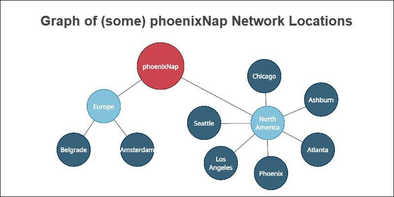

# What Is a Graph Database?

## Introduction

Graph databases are [NoSQL](what-is-nosql.md) systems created for exploring correlation within complexly interconnected entities. The structure addresses the limitations found in [relational databases](what-is-a-relational-database.md) by putting a greater accent on the [data relationship](database-relationships.md).

The graph database approach allows for more leisurely interconnection exploration, providing answers to complex questions about how data points relate to each other.

**This article explains what graph databases are and how they work.**

## What Is a Graph Database?

A **graph database** is a [NoSQL-type database](nosql-database-types.md) system based on a topographical network structure. The idea stems from graph theory in mathematics, where graphs represent data sets using **nodes**, **edges**, and **properties**.

- **Nodes** or points are instances or entities of data which represent any object to be tracked, such as people, accounts, locations, etc.
- **Edges** or lines are the critical concepts in graph databases which represent relationships between nodes. The connections have a direction that is either unidirectional (one way) or bidirectional (two way).
- **Properties** represent descriptive information associated with nodes. In some cases, edges have properties as well.

For example, analyze some of the network locations of phoenixNap:

**Nodes** with descriptive **properties** form relationships represented by **edges**.

Graph databases provide a conceptual view of data more closely related to the real world. Modeling complex connections becomes easier since relationships between data points are given an equal value of importance as the data itself.

## Graph Database vs. Relational Database

Graph databases are not meant to replace relational databases. As of now, relational databases are the industry standard. The most important aspect is to know what each database type has to offer.

Relational databases provide a structured approach to data, whereas graph databases are agile and focus on quick data relationship insight.

Both graph and relational databases have their domain. Use cases with complex relationships leverage the power of graph databases, outperforming traditional relational databases. Relational databases such as MySQL or PostgreSQL require careful planning when creating database models, whereas graphs have a much more naturalistic and fluid approach to data.

The following table outlines the critical differences between graph and relational databases:

| **Type**            | **Graph**                                   | **Relational**                                               |
| ------------------- | ------------------------------------------- | ------------------------------------------------------------ |
| **Format**          | Nodes and edges with properties             | Tables with rows and columns                                 |
| **Relationships**   | Represented with edges between nodes        | Created using foreign keys between tables                    |
| **Flexibility**     | Flexible                                    | Rigid                                                        |
| **Complex queries** | Quick and responsive                        | Requires complex joins                                       |
| **Use-case**        | Systems with highly connected relationships | Transaction focused systems with more straightforward relationships |

## How Do Graph Databases Work?

Graph databases work by treating data and relationships between data equally. Related nodes are physically connected, and the physical connection is also treated as a piece of data.

Modeling data in this way allows querying relationships in the same manner as querying the data itself. Instead of calculating and querying the connection steps, graph databases read the relationship from storage directly.

Graph databases are more closely related to other [NoSQL data modeling](nosql-data-modeling.md) techniques in terms of agility, performance, and flexibility. Like other NoSQL databases, graphs do not have schemas, which makes the model flexible and easy to alter along the way.

## Graph Database Use Case Examples

There are many notable examples where graph databases outperform other database modeling techniques, some of which include:

- **Real-Time Recommendation Engines**. Real-time product and ecommerce recommendations provide a better user experience while maximizing profitability. Notable cases include Netflix, eBay, and Walmart.
- **Master Data Management**. Linking all company data to one location for a single point of reference provides data consistency and accuracy. Master data management is crucial for large-scale global companies.
- **GDPR and regulation compliances**. Graphs make tracking of data movement and security easier to manage. The databases reduce the potential of data breaches and provide better consistency when removing data, improving the overall trust with sensitive information.
- **Digital asset management**. The amount of digital content is massive and constantly increasing. Graph databases provide a scalable and straightforward database model to keep track of digital assets, such as documents, evaluations, contracts, etc.
- **Context-aware services**. Graphs help provide services related to actual-world characteristics. Whether it is natural disaster warnings, traffic updates, or product recommendations for a given location, graph databases offer a logical solution to real-life circumstances.
- **Fraud detection**. Finding suspicious patterns and uncovering fraudulent [payment transactions](https://ccbill.com/blog/how-does-payment-processing-work) is done in real-time using graph databases. Targeting and isolating parts of graphs provide quicker detection of deceptive behavior.
- **Semantic search**. Natural language processing is ambiguous. Semantic searches help provide meaning behind keywords for more relevant results, which is easier to map using graph databases.
- **Network management**. Networks are linked graphs in their essence. Graphs reduce the time needed to alert a network administrator about problems in a network.
- **Routing**. Information travels through a network by finding optimal paths makes graph databases the perfect choice for routing.

## What Are the Well-Known Graph Databases?

Graph databases became more popular with the rise of big data and social media analytics. Many multi-model databases support graph modeling. However, there are numerous graph native databases available as well.

### JanusGraph

**JanusGraph** is a distributed, open-source and scalable graph database system with a wide range of integration options catered to big data analytics. Some of the main features of JanusGraph include:

- Support for [ACID transactions](https://phoenixnap.com/kb/acid-vs-base) with the ability to bear thousands of concurrent users.
- Multiple options for storing the graph data, such as [Cassandra](https://phoenixnap.com/kb/install-cassandra-on-ubuntu) or HBase.
- Complex search available by default as well as optional support for [Elasticsearch](https://phoenixnap.com/kb/install-elasticsearch-ubuntu).
- Full integration with Apache Spark for advanced [data analytics](https://phoenixnap.com/glossary/data-analytics).
- JanusGraph uses the graph transversal query language Gremlin, which is Turing complete.

### Neo4j

**Neo4j** (**N**etwork **E**xploration and **O**ptimization **4** **J**ava) is a graph database written in Java with native graph storage and processing. The main features of Neo4j are:

- The database is scalable through data partitioning into pieces known as shards.
- [High availability](https://phoenixnap.com/blog/what-is-high-availability) provided through continuous backups and rolling upgrades.
- Multiple instances of databases are separable while remaining on one [dedicated server](https://phoenixnap.com/servers/dedicated), providing a high level of security.
- Neo4j uses the Cypher graph query language, which is programmer friendly.

### DGraph

**DGraph** (**D**istributed **graph**) is an open-source distributed graph database system designed with scalability in mind. Some exciting features of DGraph include:

- Horizontal scalability for running in production with ACID transactions.
- DGraph is an open-source system with support for many open standards.
- The query language is GraphQL, which is designed for APIs.

### DataStax Enterprise Graph

The **DataStax Enterprise Graph** is a distributed graph database based on Cassandra and optimized for enterprises. Features include:

- DataStax provides continuous availability for enterprise needs.
- The database integrates with offline Apache Spark seamlessly.
- Real-time search and analytics are fully integrated.
- Scalability available through multiple data centers.
- It supports Gremlin as well as CQL for querying.

## Graph Database Advantages and Disadvantages

Every database type comes with strengths and weaknesses. The most important aspect is to know the differences as well as available options for specific problems. Graph databases are a growing technology with different objectives than other database types.

### Advantages

Some advantages of graph databases include:

- The structures are agile and flexible.
- The representation of relationships between entities is explicit.
- Queries output real-time results. The speed depends on the number of relationships.

### Disadvantages

The general disadvantages of graph databases are:

- There is no standardized query language. The language depends on the platform used.
- Graphs are inappropriate for transactional-based systems.
- The user-base is small, making it hard to find support when running into a problem.

**Conclusion**

Graph databases are an excellent approach for analyzing complex relationships between data entities. The fast query time with real-time results cater to the fast-paced data research of today. Graphs are a developing technology with more improvements to come.

To learn more about the different database models out there, check out our guide on [object-oriented databases](https://phoenixnap.com/kb/object-oriented-database).